# ASSET-LOG

Rendered by `gen/render_log.py` from the JSON sidecars in `gen/log/`. Every run is listed, including rejects.
Tag `design-v1` precedes every timestamp below (checked by `scripts/audit_repo.py --stage final`).

## ART-EN-01

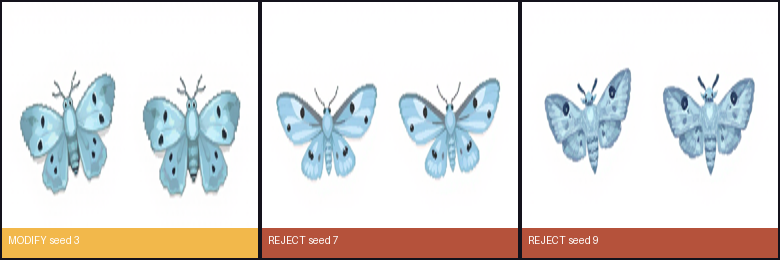

### ART-EN-01-20260930T004244Z-s3

| Field | Value |
|---|---|
| Created (UTC) | 2026-09-30T00:43:24+00:00 |
| Model / version | black-forest-labs/FLUX.1-schnell / mflux 0.20.0 (Python API); 4-bit copy saved locally with mflux-save from FLUX.1-schnell @ 741f7c3 |
| Runtime | local — arm64 macOS 26.6.2 (Apple M4 Pro, 16 GB) |
| Licence / terms | Apache-2.0 (FLUX.1-schnell weights); outputs usable without restriction |
| Settings | `{"seed": 3, "width": 768, "height": 384, "steps": 4, "quantize": 4, "seconds": 39.9, "peak_gb": 13.12}` |
| Storyboard panels | P2, P3, P6 |
| Decision | **modify** by Bao Xing at 2026-09-30T01:33:52+00:00 |
| Reason | Clearest wing/body shapes at 24 px; pale mist colour stands out from the ground. |
| Manual edits | keyed white bg + grey shadow; reduced 4x-supersampled; locked to the palette in Lab space (environment); 1-px outline; two figures cut with gen/figures.py; FLUX drew both frames almost the same, so frame 2 is squashed vertically to 60% to read as a wing beat |
| Project files | godot/assets/art/enemy_moth.png |
| Thumbnail | 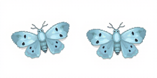 |

**Processing (every edit, in order)**

1. `{"utc": "2026-09-30T01:34:03+00:00", "tool": "gen/art_process.py", "mapping": "gen/mappings/ART-EN-01.json", "frame": "f0", "out": "godot/assets/art/enemy_moth.png", "index": 0, "mirror": false, "recolor": null, "trim_shadow": false, "post_squash_y": null, "box": [53, 102, 341, 291], "lamp_px": null, "frame_px": [24, 24], "palette": "environment", "supersample": 4, "outline": true}`
2. `{"utc": "2026-09-30T01:34:03+00:00", "tool": "gen/art_process.py", "mapping": "gen/mappings/ART-EN-01.json", "frame": "f1", "out": "godot/assets/art/enemy_moth.png", "index": 1, "mirror": false, "recolor": null, "trim_shadow": false, "post_squash_y": 0.6, "box": [422, 109, 715, 294], "lamp_px": null, "frame_px": [24, 24], "palette": "environment", "supersample": 4, "outline": true}`

**Prompt**

```
two animation frames side by side of one small pale grey-blue night moth seen from above, wings up in the left frame and wings down in the right frame, soft misty colours, 16-bit pixel art video game sprite, plain flat white background, crisp hard-edged square pixels, flat 2D colours, 1-pixel dark outline, no 3D rendering, no shading, no gradients, no anti-aliasing, no text, no letters, no watermark
```

**Negative prompt**

```
N/A — FLUX.1-schnell is guidance-distilled; mflux accepts no negative prompt for it. Exclusions (3D shading, gradients, text) are written into the positive prompt.
```

### ART-EN-01-20260930T004324Z-s7

| Field | Value |
|---|---|
| Created (UTC) | 2026-09-30T00:44:04+00:00 |
| Model / version | black-forest-labs/FLUX.1-schnell / mflux 0.20.0 (Python API); 4-bit copy saved locally with mflux-save from FLUX.1-schnell @ 741f7c3 |
| Runtime | local — arm64 macOS 26.6.2 (Apple M4 Pro, 16 GB) |
| Licence / terms | Apache-2.0 (FLUX.1-schnell weights); outputs usable without restriction |
| Settings | `{"seed": 7, "width": 768, "height": 384, "steps": 4, "quantize": 4, "seconds": 39.6, "peak_gb": 13.09}` |
| Storyboard panels | P2, P3, P6 |
| Decision | **reject** by Bao Xing at 2026-09-30T01:33:39+00:00 |
| Reason | Wings flatten into a bar at 24 px. |
| Manual edits | — |
| Project files | — |
| Thumbnail | 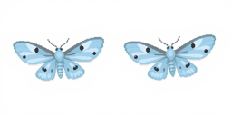 |

**Prompt**

```
two animation frames side by side of one small pale grey-blue night moth seen from above, wings up in the left frame and wings down in the right frame, soft misty colours, 16-bit pixel art video game sprite, plain flat white background, crisp hard-edged square pixels, flat 2D colours, 1-pixel dark outline, no 3D rendering, no shading, no gradients, no anti-aliasing, no text, no letters, no watermark
```

**Negative prompt**

```
N/A — FLUX.1-schnell is guidance-distilled; mflux accepts no negative prompt for it. Exclusions (3D shading, gradients, text) are written into the positive prompt.
```

### ART-EN-01-20260930T004404Z-s9

| Field | Value |
|---|---|
| Created (UTC) | 2026-09-30T00:44:58+00:00 |
| Model / version | black-forest-labs/FLUX.1-schnell / mflux 0.20.0 (Python API); 4-bit copy saved locally with mflux-save from FLUX.1-schnell @ 741f7c3 |
| Runtime | local — arm64 macOS 26.6.2 (Apple M4 Pro, 16 GB) |
| Licence / terms | Apache-2.0 (FLUX.1-schnell weights); outputs usable without restriction |
| Settings | `{"seed": 9, "width": 768, "height": 384, "steps": 4, "quantize": 4, "seconds": 54.0, "peak_gb": 13.12}` |
| Storyboard panels | P2, P3, P6 |
| Decision | **reject** by Bao Xing at 2026-09-30T01:33:39+00:00 |
| Reason | Dark wing markings turn into noisy pixels at 24 px. |
| Manual edits | — |
| Project files | — |
| Thumbnail | 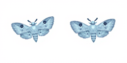 |

**Prompt**

```
two animation frames side by side of one small pale grey-blue night moth seen from above, wings up in the left frame and wings down in the right frame, soft misty colours, 16-bit pixel art video game sprite, plain flat white background, crisp hard-edged square pixels, flat 2D colours, 1-pixel dark outline, no 3D rendering, no shading, no gradients, no anti-aliasing, no text, no letters, no watermark
```

**Negative prompt**

```
N/A — FLUX.1-schnell is guidance-distilled; mflux accepts no negative prompt for it. Exclusions (3D shading, gradients, text) are written into the positive prompt.
```

## ART-EN-02

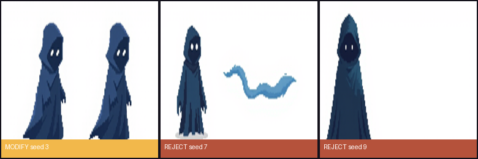

### ART-EN-02-20260930T004502Z-s3

| Field | Value |
|---|---|
| Created (UTC) | 2026-09-30T00:46:08+00:00 |
| Model / version | black-forest-labs/FLUX.1-schnell / mflux 0.20.0 (Python API); 4-bit copy saved locally with mflux-save from FLUX.1-schnell @ 741f7c3 |
| Runtime | local — arm64 macOS 26.6.2 (Apple M4 Pro, 16 GB) |
| Licence / terms | Apache-2.0 (FLUX.1-schnell weights); outputs usable without restriction |
| Settings | `{"seed": 3, "width": 768, "height": 384, "steps": 4, "quantize": 4, "seconds": 66.3, "peak_gb": 13.12}` |
| Storyboard panels | P5 |
| Decision | **modify** by Bao Xing at 2026-09-30T01:33:52+00:00 |
| Reason | Hooded figure with two pale eyes; two usable frames. |
| Manual edits | keyed white bg + grey shadow; reduced 4x-supersampled; locked to the palette in Lab space (environment); 1-px outline; two figures cut with gen/figures.py; pale floor shadow trimmed from the bottom 12% of each figure; frame 2 squashed to 92% as a breathing frame |
| Project files | godot/assets/art/enemy_wraith.png |
| Thumbnail |  |

**Processing (every edit, in order)**

1. `{"utc": "2026-09-30T01:34:03+00:00", "tool": "gen/art_process.py", "mapping": "gen/mappings/ART-EN-02.json", "frame": "f0", "out": "godot/assets/art/enemy_wraith.png", "index": 0, "mirror": false, "recolor": null, "trim_shadow": true, "post_squash_y": null, "box": [106, 52, 344, 362], "lamp_px": null, "frame_px": [40, 40], "palette": "environment", "supersample": 4, "outline": true}`
2. `{"utc": "2026-09-30T01:34:03+00:00", "tool": "gen/art_process.py", "mapping": "gen/mappings/ART-EN-02.json", "frame": "f1", "out": "godot/assets/art/enemy_wraith.png", "index": 1, "mirror": false, "recolor": null, "trim_shadow": true, "post_squash_y": 0.92, "box": [428, 52, 670, 362], "lamp_px": null, "frame_px": [40, 40], "palette": "environment", "supersample": 4, "outline": true}`

**Prompt**

```
two animation frames side by side of one hooded ghostly fog wraith made of dark blue mist with two faint pale eye-dots, drifting pose, frame two slightly stretched, 16-bit pixel art video game sprite, plain flat white background, crisp hard-edged square pixels, flat 2D colours, 1-pixel dark outline, no 3D rendering, no shading, no gradients, no anti-aliasing, no text, no letters, no watermark
```

**Negative prompt**

```
N/A — FLUX.1-schnell is guidance-distilled; mflux accepts no negative prompt for it. Exclusions (3D shading, gradients, text) are written into the positive prompt.
```

### ART-EN-02-20260930T004608Z-s7

| Field | Value |
|---|---|
| Created (UTC) | 2026-09-30T00:47:08+00:00 |
| Model / version | black-forest-labs/FLUX.1-schnell / mflux 0.20.0 (Python API); 4-bit copy saved locally with mflux-save from FLUX.1-schnell @ 741f7c3 |
| Runtime | local — arm64 macOS 26.6.2 (Apple M4 Pro, 16 GB) |
| Licence / terms | Apache-2.0 (FLUX.1-schnell weights); outputs usable without restriction |
| Settings | `{"seed": 7, "width": 768, "height": 384, "steps": 4, "quantize": 4, "seconds": 59.9, "peak_gb": 13.12}` |
| Storyboard panels | P5 |
| Decision | **reject** by Bao Xing at 2026-09-30T01:33:39+00:00 |
| Reason | Only one figure, plus a stray mist ribbon. |
| Manual edits | — |
| Project files | — |
| Thumbnail |  |

**Prompt**

```
two animation frames side by side of one hooded ghostly fog wraith made of dark blue mist with two faint pale eye-dots, drifting pose, frame two slightly stretched, 16-bit pixel art video game sprite, plain flat white background, crisp hard-edged square pixels, flat 2D colours, 1-pixel dark outline, no 3D rendering, no shading, no gradients, no anti-aliasing, no text, no letters, no watermark
```

**Negative prompt**

```
N/A — FLUX.1-schnell is guidance-distilled; mflux accepts no negative prompt for it. Exclusions (3D shading, gradients, text) are written into the positive prompt.
```

### ART-EN-02-20260930T004708Z-s9

| Field | Value |
|---|---|
| Created (UTC) | 2026-09-30T00:48:11+00:00 |
| Model / version | black-forest-labs/FLUX.1-schnell / mflux 0.20.0 (Python API); 4-bit copy saved locally with mflux-save from FLUX.1-schnell @ 741f7c3 |
| Runtime | local — arm64 macOS 26.6.2 (Apple M4 Pro, 16 GB) |
| Licence / terms | Apache-2.0 (FLUX.1-schnell weights); outputs usable without restriction |
| Settings | `{"seed": 9, "width": 768, "height": 384, "steps": 4, "quantize": 4, "seconds": 62.8, "peak_gb": 13.12}` |
| Storyboard panels | P5 |
| Decision | **reject** by Bao Xing at 2026-09-30T01:33:39+00:00 |
| Reason | Single frame; the face becomes a dark blob at 40 px. |
| Manual edits | — |
| Project files | — |
| Thumbnail |  |

**Prompt**

```
two animation frames side by side of one hooded ghostly fog wraith made of dark blue mist with two faint pale eye-dots, drifting pose, frame two slightly stretched, 16-bit pixel art video game sprite, plain flat white background, crisp hard-edged square pixels, flat 2D colours, 1-pixel dark outline, no 3D rendering, no shading, no gradients, no anti-aliasing, no text, no letters, no watermark
```

**Negative prompt**

```
N/A — FLUX.1-schnell is guidance-distilled; mflux accepts no negative prompt for it. Exclusions (3D shading, gradients, text) are written into the positive prompt.
```

## ART-ENV-01

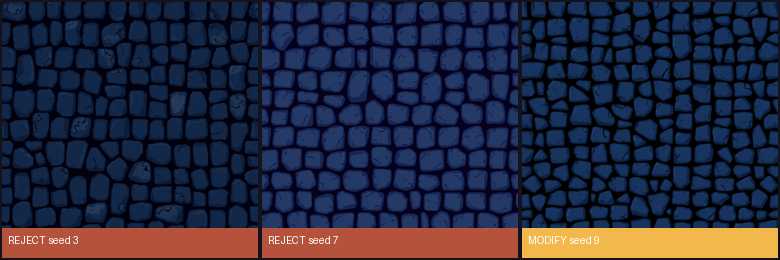

### ART-ENV-01-20260930T004815Z-s3

| Field | Value |
|---|---|
| Created (UTC) | 2026-09-30T00:50:19+00:00 |
| Model / version | black-forest-labs/FLUX.1-schnell / mflux 0.20.0 (Python API); 4-bit copy saved locally with mflux-save from FLUX.1-schnell @ 741f7c3 |
| Runtime | local — arm64 macOS 26.6.2 (Apple M4 Pro, 16 GB) |
| Licence / terms | Apache-2.0 (FLUX.1-schnell weights); outputs usable without restriction |
| Settings | `{"seed": 3, "width": 768, "height": 768, "steps": 4, "quantize": 4, "seconds": 124.0, "peak_gb": 16.45}` |
| Storyboard panels | P2, P3, P8 |
| Decision | **reject** by Bao Xing at 2026-09-30T01:33:39+00:00 |
| Reason | Failed the seam check (seam 5.05 vs interior 3.91). |
| Manual edits | — |
| Project files | — |
| Thumbnail | 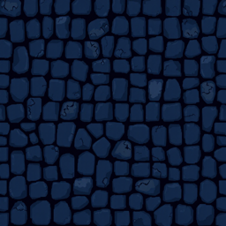 |

**Prompt**

```
16-bit pixel art seamless tileable top-down texture of old rounded cobblestones at night, cool dark blue and grey stones, thin dark gaps, flat 2D colours, crisp hard-edged square pixels, even lighting, no objects, no 3D rendering, no gradients, no text, no watermark
```

**Negative prompt**

```
N/A — FLUX.1-schnell is guidance-distilled; mflux accepts no negative prompt for it. Exclusions (3D shading, gradients, text) are written into the positive prompt.
```

### ART-ENV-01-20260930T005019Z-s7

| Field | Value |
|---|---|
| Created (UTC) | 2026-09-30T00:52:34+00:00 |
| Model / version | black-forest-labs/FLUX.1-schnell / mflux 0.20.0 (Python API); 4-bit copy saved locally with mflux-save from FLUX.1-schnell @ 741f7c3 |
| Runtime | local — arm64 macOS 26.6.2 (Apple M4 Pro, 16 GB) |
| Licence / terms | Apache-2.0 (FLUX.1-schnell weights); outputs usable without restriction |
| Settings | `{"seed": 7, "width": 768, "height": 768, "steps": 4, "quantize": 4, "seconds": 135.1, "peak_gb": 16.46}` |
| Storyboard panels | P2, P3, P8 |
| Decision | **reject** by Bao Xing at 2026-09-30T01:33:39+00:00 |
| Reason | Failed the seam check (12.78 vs 7.25); light stones would compete with the enemies. |
| Manual edits | — |
| Project files | — |
| Thumbnail | 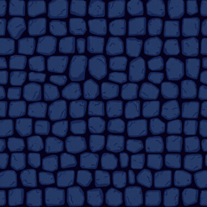 |

**Prompt**

```
16-bit pixel art seamless tileable top-down texture of old rounded cobblestones at night, cool dark blue and grey stones, thin dark gaps, flat 2D colours, crisp hard-edged square pixels, even lighting, no objects, no 3D rendering, no gradients, no text, no watermark
```

**Negative prompt**

```
N/A — FLUX.1-schnell is guidance-distilled; mflux accepts no negative prompt for it. Exclusions (3D shading, gradients, text) are written into the positive prompt.
```

### ART-ENV-01-20260930T005234Z-s9

| Field | Value |
|---|---|
| Created (UTC) | 2026-09-30T00:54:40+00:00 |
| Model / version | black-forest-labs/FLUX.1-schnell / mflux 0.20.0 (Python API); 4-bit copy saved locally with mflux-save from FLUX.1-schnell @ 741f7c3 |
| Runtime | local — arm64 macOS 26.6.2 (Apple M4 Pro, 16 GB) |
| Licence / terms | Apache-2.0 (FLUX.1-schnell weights); outputs usable without restriction |
| Settings | `{"seed": 9, "width": 768, "height": 768, "steps": 4, "quantize": 4, "seconds": 126.5, "peak_gb": 16.46}` |
| Storyboard panels | P2, P3, P8 |
| Decision | **modify** by Bao Xing at 2026-09-30T01:33:52+00:00 |
| Reason | Darkest, most natural stones; passes the seam check (7.52 vs interior 6.05). |
| Manual edits | centre 40% crop; made tileable by cross-fading with a half-offset copy; 64x64; locked to the environment palette |
| Project files | godot/assets/art/env_ground_tile.png |
| Thumbnail | 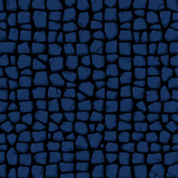 |

**Processing (every edit, in order)**

1. `{"utc": "2026-09-30T01:34:03+00:00", "tool": "gen/tile_process.py", "src": "gen/accepted/ART-ENV-01/ART-ENV-01-20260930T005234Z-s9.png", "crop": 0.4, "out": "godot/assets/art/env_ground_tile.png", "seam_mean_abs": 7.52, "interior_mean_abs": 6.05, "pass": true}`

**Prompt**

```
16-bit pixel art seamless tileable top-down texture of old rounded cobblestones at night, cool dark blue and grey stones, thin dark gaps, flat 2D colours, crisp hard-edged square pixels, even lighting, no objects, no 3D rendering, no gradients, no text, no watermark
```

**Negative prompt**

```
N/A — FLUX.1-schnell is guidance-distilled; mflux accepts no negative prompt for it. Exclusions (3D shading, gradients, text) are written into the positive prompt.
```

## ART-ENV-02

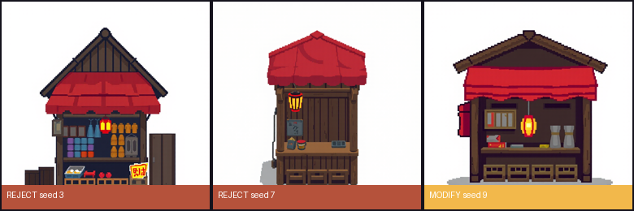

### ART-ENV-02-20260930T005445Z-s3

| Field | Value |
|---|---|
| Created (UTC) | 2026-09-30T00:57:13+00:00 |
| Model / version | black-forest-labs/FLUX.1-schnell / mflux 0.20.0 (Python API); 4-bit copy saved locally with mflux-save from FLUX.1-schnell @ 741f7c3 |
| Runtime | local — arm64 macOS 26.6.2 (Apple M4 Pro, 16 GB) |
| Licence / terms | Apache-2.0 (FLUX.1-schnell weights); outputs usable without restriction |
| Settings | `{"seed": 3, "width": 768, "height": 768, "steps": 4, "quantize": 4, "seconds": 148.5, "peak_gb": 16.45}` |
| Storyboard panels | P1, P2 |
| Decision | **reject** by Bao Xing at 2026-09-30T01:33:39+00:00 |
| Reason | Sign with text-like marks (text is excluded) and too much clutter. |
| Manual edits | — |
| Project files | — |
| Thumbnail | 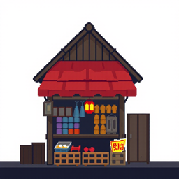 |

**Prompt**

```
a small wooden night-market stall seen from a high three-quarter angle, red cloth awning, one glowing paper lantern hanging at the front, crates underneath, 16-bit pixel art video game sprite, plain flat white background, crisp hard-edged square pixels, flat 2D colours, 1-pixel dark outline, no 3D rendering, no shading, no gradients, no anti-aliasing, no text, no letters, no watermark
```

**Negative prompt**

```
N/A — FLUX.1-schnell is guidance-distilled; mflux accepts no negative prompt for it. Exclusions (3D shading, gradients, text) are written into the positive prompt.
```

### ART-ENV-02-20260930T005713Z-s7

| Field | Value |
|---|---|
| Created (UTC) | 2026-09-30T00:58:58+00:00 |
| Model / version | black-forest-labs/FLUX.1-schnell / mflux 0.20.0 (Python API); 4-bit copy saved locally with mflux-save from FLUX.1-schnell @ 741f7c3 |
| Runtime | local — arm64 macOS 26.6.2 (Apple M4 Pro, 16 GB) |
| Licence / terms | Apache-2.0 (FLUX.1-schnell weights); outputs usable without restriction |
| Settings | `{"seed": 7, "width": 768, "height": 768, "steps": 4, "quantize": 4, "seconds": 105.0, "peak_gb": 16.46}` |
| Storyboard panels | P1, P2 |
| Decision | **reject** by Bao Xing at 2026-09-30T01:33:39+00:00 |
| Reason | Lower half turns into a dark block at 64x48. |
| Manual edits | — |
| Project files | — |
| Thumbnail | 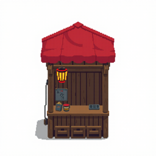 |

**Prompt**

```
a small wooden night-market stall seen from a high three-quarter angle, red cloth awning, one glowing paper lantern hanging at the front, crates underneath, 16-bit pixel art video game sprite, plain flat white background, crisp hard-edged square pixels, flat 2D colours, 1-pixel dark outline, no 3D rendering, no shading, no gradients, no anti-aliasing, no text, no letters, no watermark
```

**Negative prompt**

```
N/A — FLUX.1-schnell is guidance-distilled; mflux accepts no negative prompt for it. Exclusions (3D shading, gradients, text) are written into the positive prompt.
```

### ART-ENV-02-20260930T005858Z-s9

| Field | Value |
|---|---|
| Created (UTC) | 2026-09-30T01:00:54+00:00 |
| Model / version | black-forest-labs/FLUX.1-schnell / mflux 0.20.0 (Python API); 4-bit copy saved locally with mflux-save from FLUX.1-schnell @ 741f7c3 |
| Runtime | local — arm64 macOS 26.6.2 (Apple M4 Pro, 16 GB) |
| Licence / terms | Apache-2.0 (FLUX.1-schnell weights); outputs usable without restriction |
| Settings | `{"seed": 9, "width": 768, "height": 768, "steps": 4, "quantize": 4, "seconds": 115.5, "peak_gb": 16.46}` |
| Storyboard panels | P1, P2 |
| Decision | **modify** by Bao Xing at 2026-09-30T01:33:52+00:00 |
| Reason | Awning, lantern and shelves still read at 64x48. |
| Manual edits | keyed white bg + grey shadow; reduced 4x-supersampled; locked to the palette in Lab space (environment); 1-px outline; bottom-anchored; floor shadow trimmed |
| Project files | godot/assets/art/env_stall.png |
| Thumbnail |  |

**Processing (every edit, in order)**

1. `{"utc": "2026-09-30T01:34:03+00:00", "tool": "gen/art_process.py", "mapping": "gen/mappings/ART-ENV-02.json", "frame": "f0", "out": "godot/assets/art/env_stall.png", "index": 0, "mirror": false, "recolor": null, "trim_shadow": true, "post_squash_y": null, "box": null, "lamp_px": null, "frame_px": [64, 48], "palette": "environment", "supersample": 4, "outline": true}`

**Prompt**

```
a small wooden night-market stall seen from a high three-quarter angle, red cloth awning, one glowing paper lantern hanging at the front, crates underneath, 16-bit pixel art video game sprite, plain flat white background, crisp hard-edged square pixels, flat 2D colours, 1-pixel dark outline, no 3D rendering, no shading, no gradients, no anti-aliasing, no text, no letters, no watermark
```

**Negative prompt**

```
N/A — FLUX.1-schnell is guidance-distilled; mflux accepts no negative prompt for it. Exclusions (3D shading, gradients, text) are written into the positive prompt.
```

## ART-FX-01

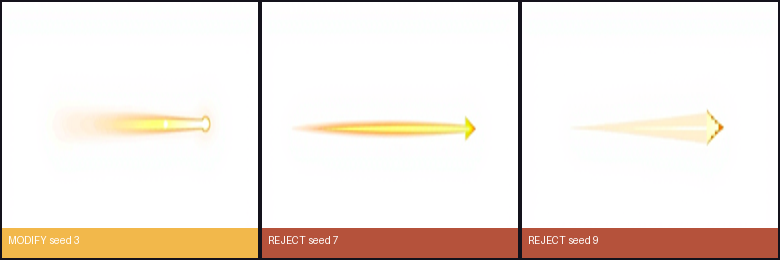

### ART-FX-01-20260930T010058Z-s3

| Field | Value |
|---|---|
| Created (UTC) | 2026-09-30T01:02:03+00:00 |
| Model / version | black-forest-labs/FLUX.1-schnell / mflux 0.20.0 (Python API); 4-bit copy saved locally with mflux-save from FLUX.1-schnell @ 741f7c3 |
| Runtime | local — arm64 macOS 26.6.2 (Apple M4 Pro, 16 GB) |
| Licence / terms | Apache-2.0 (FLUX.1-schnell weights); outputs usable without restriction |
| Settings | `{"seed": 3, "width": 768, "height": 384, "steps": 4, "quantize": 4, "seconds": 64.4, "peak_gb": 13.12}` |
| Storyboard panels | P3 |
| Decision | **modify** by Bao Xing at 2026-09-30T01:33:52+00:00 |
| Reason | Survives the reduction to 16x8 as a bar with a gold tip. |
| Manual edits | keyed white bg + grey shadow; reduced 4x-supersampled; locked to the palette in Lab space (character); no outline (it is light) |
| Project files | godot/assets/art/fx_beam.png |
| Thumbnail | 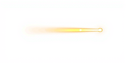 |

**Processing (every edit, in order)**

1. `{"utc": "2026-09-30T01:34:03+00:00", "tool": "gen/art_process.py", "mapping": "gen/mappings/ART-FX-01.json", "frame": "f0", "out": "godot/assets/art/fx_beam.png", "index": 0, "mirror": false, "recolor": null, "trim_shadow": false, "post_squash_y": null, "box": null, "lamp_px": null, "frame_px": [16, 8], "palette": "character", "supersample": 4, "outline": false}`

**Prompt**

```
a short horizontal bolt of warm cream and golden light pointing right, soft rounded tip, 16-bit pixel art video game sprite, plain flat white background, crisp hard-edged square pixels, flat 2D colours, 1-pixel dark outline, no 3D rendering, no shading, no gradients, no anti-aliasing, no text, no letters, no watermark
```

**Negative prompt**

```
N/A — FLUX.1-schnell is guidance-distilled; mflux accepts no negative prompt for it. Exclusions (3D shading, gradients, text) are written into the positive prompt.
```

### ART-FX-01-20260930T010203Z-s7

| Field | Value |
|---|---|
| Created (UTC) | 2026-09-30T01:03:16+00:00 |
| Model / version | black-forest-labs/FLUX.1-schnell / mflux 0.20.0 (Python API); 4-bit copy saved locally with mflux-save from FLUX.1-schnell @ 741f7c3 |
| Runtime | local — arm64 macOS 26.6.2 (Apple M4 Pro, 16 GB) |
| Licence / terms | Apache-2.0 (FLUX.1-schnell weights); outputs usable without restriction |
| Settings | `{"seed": 7, "width": 768, "height": 384, "steps": 4, "quantize": 4, "seconds": 73.5, "peak_gb": 13.12}` |
| Storyboard panels | P3 |
| Decision | **reject** by Bao Xing at 2026-09-30T01:33:39+00:00 |
| Reason | Thin bolt vanishes completely at 16x8. |
| Manual edits | — |
| Project files | — |
| Thumbnail | 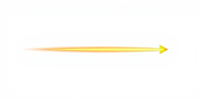 |

**Prompt**

```
a short horizontal bolt of warm cream and golden light pointing right, soft rounded tip, 16-bit pixel art video game sprite, plain flat white background, crisp hard-edged square pixels, flat 2D colours, 1-pixel dark outline, no 3D rendering, no shading, no gradients, no anti-aliasing, no text, no letters, no watermark
```

**Negative prompt**

```
N/A — FLUX.1-schnell is guidance-distilled; mflux accepts no negative prompt for it. Exclusions (3D shading, gradients, text) are written into the positive prompt.
```

### ART-FX-01-20260930T010316Z-s9

| Field | Value |
|---|---|
| Created (UTC) | 2026-09-30T01:04:11+00:00 |
| Model / version | black-forest-labs/FLUX.1-schnell / mflux 0.20.0 (Python API); 4-bit copy saved locally with mflux-save from FLUX.1-schnell @ 741f7c3 |
| Runtime | local — arm64 macOS 26.6.2 (Apple M4 Pro, 16 GB) |
| Licence / terms | Apache-2.0 (FLUX.1-schnell weights); outputs usable without restriction |
| Settings | `{"seed": 9, "width": 768, "height": 384, "steps": 4, "quantize": 4, "seconds": 55.1, "peak_gb": 13.12}` |
| Storyboard panels | P3 |
| Decision | **reject** by Bao Xing at 2026-09-30T01:33:39+00:00 |
| Reason | Reads as a cone, not a bolt. |
| Manual edits | — |
| Project files | — |
| Thumbnail |  |

**Prompt**

```
a short horizontal bolt of warm cream and golden light pointing right, soft rounded tip, 16-bit pixel art video game sprite, plain flat white background, crisp hard-edged square pixels, flat 2D colours, 1-pixel dark outline, no 3D rendering, no shading, no gradients, no anti-aliasing, no text, no letters, no watermark
```

**Negative prompt**

```
N/A — FLUX.1-schnell is guidance-distilled; mflux accepts no negative prompt for it. Exclusions (3D shading, gradients, text) are written into the positive prompt.
```

## ART-FX-02

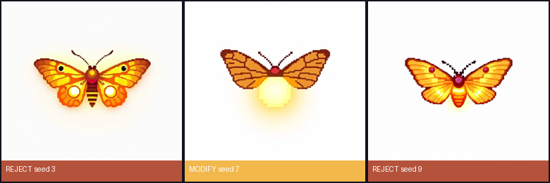

### ART-FX-02-20260930T010415Z-s3

| Field | Value |
|---|---|
| Created (UTC) | 2026-09-30T01:05:07+00:00 |
| Model / version | black-forest-labs/FLUX.1-schnell / mflux 0.20.0 (Python API); 4-bit copy saved locally with mflux-save from FLUX.1-schnell @ 741f7c3 |
| Runtime | local — arm64 macOS 26.6.2 (Apple M4 Pro, 16 GB) |
| Licence / terms | Apache-2.0 (FLUX.1-schnell weights); outputs usable without restriction |
| Settings | `{"seed": 3, "width": 512, "height": 512, "steps": 4, "quantize": 4, "seconds": 52.4, "peak_gb": 12.75}` |
| Storyboard panels | P4, P6 |
| Decision | **reject** by Bao Xing at 2026-09-30T01:33:39+00:00 |
| Reason | Eyespot moth reads as an enemy, not as light. |
| Manual edits | — |
| Project files | — |
| Thumbnail |  |

**Prompt**

```
a tiny round glowing lamp-moth made of warm golden light seen from above, wings spread, 16-bit pixel art video game sprite, plain flat white background, crisp hard-edged square pixels, flat 2D colours, 1-pixel dark outline, no 3D rendering, no shading, no gradients, no anti-aliasing, no text, no letters, no watermark
```

**Negative prompt**

```
N/A — FLUX.1-schnell is guidance-distilled; mflux accepts no negative prompt for it. Exclusions (3D shading, gradients, text) are written into the positive prompt.
```

### ART-FX-02-20260930T010507Z-s7

| Field | Value |
|---|---|
| Created (UTC) | 2026-09-30T01:05:53+00:00 |
| Model / version | black-forest-labs/FLUX.1-schnell / mflux 0.20.0 (Python API); 4-bit copy saved locally with mflux-save from FLUX.1-schnell @ 741f7c3 |
| Runtime | local — arm64 macOS 26.6.2 (Apple M4 Pro, 16 GB) |
| Licence / terms | Apache-2.0 (FLUX.1-schnell weights); outputs usable without restriction |
| Settings | `{"seed": 7, "width": 512, "height": 512, "steps": 4, "quantize": 4, "seconds": 45.8, "peak_gb": 12.75}` |
| Storyboard panels | P4, P6 |
| Decision | **modify** by Bao Xing at 2026-09-30T01:33:52+00:00 |
| Reason | Glowing body = a moth made of lamp light, as in CONCEPT. |
| Manual edits | keyed white bg + grey shadow; reduced 4x-supersampled; locked to the palette in Lab space (character); 1-px outline |
| Project files | godot/assets/art/fx_orbit_moth.png |
| Thumbnail |  |

**Processing (every edit, in order)**

1. `{"utc": "2026-09-30T01:34:03+00:00", "tool": "gen/art_process.py", "mapping": "gen/mappings/ART-FX-02.json", "frame": "f0", "out": "godot/assets/art/fx_orbit_moth.png", "index": 0, "mirror": false, "recolor": null, "trim_shadow": false, "post_squash_y": null, "box": null, "lamp_px": null, "frame_px": [12, 12], "palette": "character", "supersample": 4, "outline": true}`

**Prompt**

```
a tiny round glowing lamp-moth made of warm golden light seen from above, wings spread, 16-bit pixel art video game sprite, plain flat white background, crisp hard-edged square pixels, flat 2D colours, 1-pixel dark outline, no 3D rendering, no shading, no gradients, no anti-aliasing, no text, no letters, no watermark
```

**Negative prompt**

```
N/A — FLUX.1-schnell is guidance-distilled; mflux accepts no negative prompt for it. Exclusions (3D shading, gradients, text) are written into the positive prompt.
```

### ART-FX-02-20260930T010553Z-s9

| Field | Value |
|---|---|
| Created (UTC) | 2026-09-30T01:06:40+00:00 |
| Model / version | black-forest-labs/FLUX.1-schnell / mflux 0.20.0 (Python API); 4-bit copy saved locally with mflux-save from FLUX.1-schnell @ 741f7c3 |
| Runtime | local — arm64 macOS 26.6.2 (Apple M4 Pro, 16 GB) |
| Licence / terms | Apache-2.0 (FLUX.1-schnell weights); outputs usable without restriction |
| Settings | `{"seed": 9, "width": 512, "height": 512, "steps": 4, "quantize": 4, "seconds": 47.1, "peak_gb": 12.75}` |
| Storyboard panels | P4, P6 |
| Decision | **reject** by Bao Xing at 2026-09-30T01:33:39+00:00 |
| Reason | No glowing body; too close to the enemy moths. |
| Manual edits | — |
| Project files | — |
| Thumbnail |  |

**Prompt**

```
a tiny round glowing lamp-moth made of warm golden light seen from above, wings spread, 16-bit pixel art video game sprite, plain flat white background, crisp hard-edged square pixels, flat 2D colours, 1-pixel dark outline, no 3D rendering, no shading, no gradients, no anti-aliasing, no text, no letters, no watermark
```

**Negative prompt**

```
N/A — FLUX.1-schnell is guidance-distilled; mflux accepts no negative prompt for it. Exclusions (3D shading, gradients, text) are written into the positive prompt.
```

## ART-FX-03

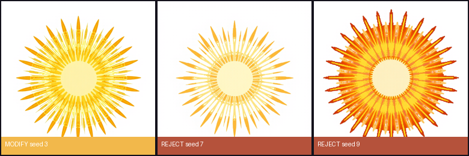

### ART-FX-03-20260930T010643Z-s3

| Field | Value |
|---|---|
| Created (UTC) | 2026-09-30T01:09:09+00:00 |
| Model / version | black-forest-labs/FLUX.1-schnell / mflux 0.20.0 (Python API); 4-bit copy saved locally with mflux-save from FLUX.1-schnell @ 741f7c3 |
| Runtime | local — arm64 macOS 26.6.2 (Apple M4 Pro, 16 GB) |
| Licence / terms | Apache-2.0 (FLUX.1-schnell weights); outputs usable without restriction |
| Settings | `{"seed": 3, "width": 768, "height": 768, "steps": 4, "quantize": 4, "seconds": 145.7, "peak_gb": 16.45}` |
| Storyboard panels | P6 |
| Decision | **modify** by Bao Xing at 2026-09-30T01:33:52+00:00 |
| Reason | Gold rays around a cream core read as a sunburst. |
| Manual edits | keyed white bg + grey shadow; reduced 4x-supersampled; locked to the palette in Lab space (character); no outline; drawn in game with fading alpha |
| Project files | godot/assets/art/fx_sunflare.png |
| Thumbnail |  |

**Processing (every edit, in order)**

1. `{"utc": "2026-09-30T01:34:03+00:00", "tool": "gen/art_process.py", "mapping": "gen/mappings/ART-FX-03.json", "frame": "f0", "out": "godot/assets/art/fx_sunflare.png", "index": 0, "mirror": false, "recolor": null, "trim_shadow": false, "post_squash_y": null, "box": null, "lamp_px": null, "frame_px": [128, 128], "palette": "character", "supersample": 4, "outline": false}`

**Prompt**

```
a radial burst of golden sunlight rays forming a ring, bright cream centre, symmetrical, seen from above, 16-bit pixel art video game sprite, plain flat white background, crisp hard-edged square pixels, flat 2D colours, 1-pixel dark outline, no 3D rendering, no shading, no gradients, no anti-aliasing, no text, no letters, no watermark
```

**Negative prompt**

```
N/A — FLUX.1-schnell is guidance-distilled; mflux accepts no negative prompt for it. Exclusions (3D shading, gradients, text) are written into the positive prompt.
```

### ART-FX-03-20260930T010909Z-s7

| Field | Value |
|---|---|
| Created (UTC) | 2026-09-30T01:11:32+00:00 |
| Model / version | black-forest-labs/FLUX.1-schnell / mflux 0.20.0 (Python API); 4-bit copy saved locally with mflux-save from FLUX.1-schnell @ 741f7c3 |
| Runtime | local — arm64 macOS 26.6.2 (Apple M4 Pro, 16 GB) |
| Licence / terms | Apache-2.0 (FLUX.1-schnell weights); outputs usable without restriction |
| Settings | `{"seed": 7, "width": 768, "height": 768, "steps": 4, "quantize": 4, "seconds": 142.8, "peak_gb": 16.46}` |
| Storyboard panels | P6 |
| Decision | **reject** by Bao Xing at 2026-09-30T01:33:39+00:00 |
| Reason | Rays too thin and pale at 128 px. |
| Manual edits | — |
| Project files | — |
| Thumbnail | 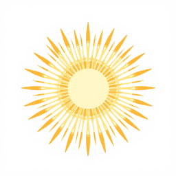 |

**Prompt**

```
a radial burst of golden sunlight rays forming a ring, bright cream centre, symmetrical, seen from above, 16-bit pixel art video game sprite, plain flat white background, crisp hard-edged square pixels, flat 2D colours, 1-pixel dark outline, no 3D rendering, no shading, no gradients, no anti-aliasing, no text, no letters, no watermark
```

**Negative prompt**

```
N/A — FLUX.1-schnell is guidance-distilled; mflux accepts no negative prompt for it. Exclusions (3D shading, gradients, text) are written into the positive prompt.
```

### ART-FX-03-20260930T011132Z-s9

| Field | Value |
|---|---|
| Created (UTC) | 2026-09-30T01:13:34+00:00 |
| Model / version | black-forest-labs/FLUX.1-schnell / mflux 0.20.0 (Python API); 4-bit copy saved locally with mflux-save from FLUX.1-schnell @ 741f7c3 |
| Runtime | local — arm64 macOS 26.6.2 (Apple M4 Pro, 16 GB) |
| Licence / terms | Apache-2.0 (FLUX.1-schnell weights); outputs usable without restriction |
| Settings | `{"seed": 9, "width": 768, "height": 768, "steps": 4, "quantize": 4, "seconds": 122.5, "peak_gb": 16.46}` |
| Storyboard panels | P6 |
| Decision | **reject** by Bao Xing at 2026-09-30T01:33:39+00:00 |
| Reason | Fills into a solid disc. |
| Manual edits | — |
| Project files | — |
| Thumbnail |  |

**Prompt**

```
a radial burst of golden sunlight rays forming a ring, bright cream centre, symmetrical, seen from above, 16-bit pixel art video game sprite, plain flat white background, crisp hard-edged square pixels, flat 2D colours, 1-pixel dark outline, no 3D rendering, no shading, no gradients, no anti-aliasing, no text, no letters, no watermark
```

**Negative prompt**

```
N/A — FLUX.1-schnell is guidance-distilled; mflux accepts no negative prompt for it. Exclusions (3D shading, gradients, text) are written into the positive prompt.
```

## ART-PC-01

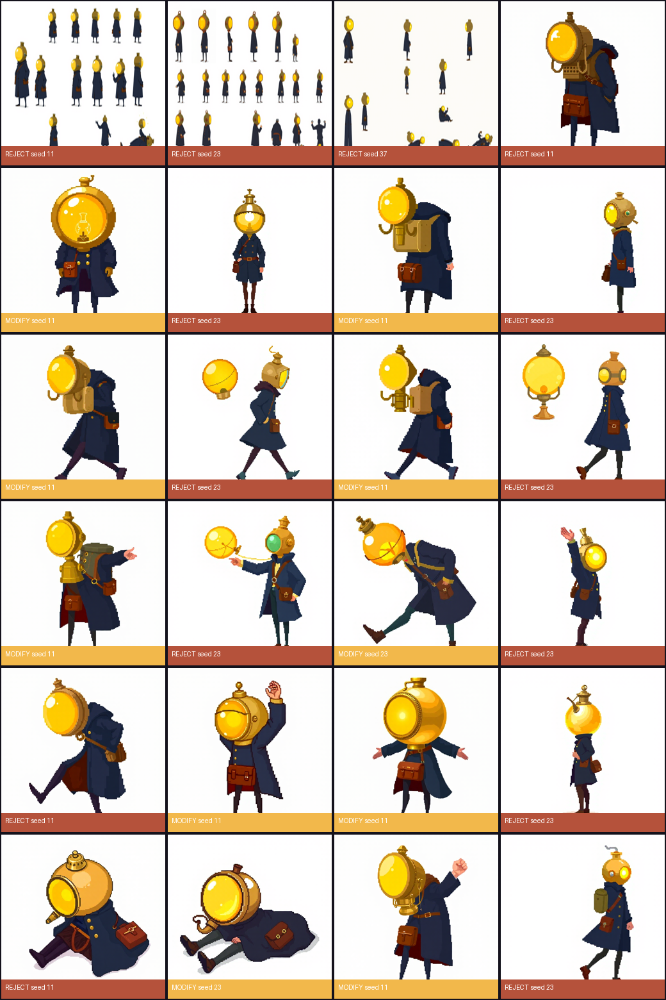

### ART-PC-01-20260929T202956Z-s11

| Field | Value |
|---|---|
| Created (UTC) | 2026-09-29T20:36:19+00:00 |
| Model / version | black-forest-labs/FLUX.1-schnell / mflux 0.20.0, 4-bit |
| Runtime | local — arm64 macOS 26.6.2 (Apple M4 Pro, 16 GB) |
| Licence / terms | Apache-2.0 (FLUX.1-schnell weights); outputs usable without restriction |
| Settings | `{"seed": 11, "width": 1536, "height": 1024, "steps": 4, "quantize": 4, "seconds": 382.6}` |
| Storyboard panels | P1, P2, P3, P4, P5, P6, P7, P8, P9 |
| Decision | **reject** by Bao Xing at 2026-09-29T20:53:50+00:00 |
| Reason | Bao 2026-09-29: rendered as a shaded, 3D-looking illustration instead of 2D pixel art ("不用3d就是2d像素游戏"); FLUX also ignored the 3x4 grid and drew mostly standing poses. Best identity of the batch (brass lamp with spout, satchel, long coat) - kept as the look to carry into the pixel-art prompt. |
| Manual edits | — |
| Project files | — |
| Thumbnail | 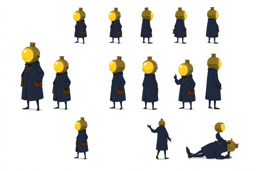 |

**Prompt**

```
character model sheet of one small original courier character repeated in twelve poses, arranged in a neat grid of 3 rows and 4 columns on a plain flat white background, every pose the same character and the same size, full body, side view facing right unless noted. The character: an oversized round brass oil-lamp for a head with a glowing warm yellow glass lens, a narrow dark navy long coat, thin dark legs, a small brown leather satchel on the left hip. Style: simple flat vector shapes, thick uniform dark outline, no gradients, no texture, limited palette of warm yellow, cream, navy, brown and near-black, clean readable silhouette, video game sprite reference. Poses in reading order: front view standing; side view standing; back view standing; relaxed idle; walking with legs apart at contact; walking with legs together passing; arm thrust forward casting a beam of light; flinching backwards hurt; both arms raised cheering; radiant power pose with a large glow halo; collapsed lying on the ground with the lamp dimmed; triumphant victory pose. No text, no letters, no numbers, no labels, no watermark, no background scenery.
```

**Negative prompt**

```
N/A — FLUX.1-schnell is guidance-distilled and mflux does not accept a negative prompt for it; exclusions (text, labels, scenery, gradients) are written into the positive prompt.
```

### ART-PC-01-20260929T203619Z-s23

| Field | Value |
|---|---|
| Created (UTC) | 2026-09-29T20:43:41+00:00 |
| Model / version | black-forest-labs/FLUX.1-schnell / mflux 0.20.0, 4-bit |
| Runtime | local — arm64 macOS 26.6.2 (Apple M4 Pro, 16 GB) |
| Licence / terms | Apache-2.0 (FLUX.1-schnell weights); outputs usable without restriction |
| Settings | `{"seed": 23, "width": 1536, "height": 1024, "steps": 4, "quantize": 4, "seconds": 442.1}` |
| Storyboard panels | P1, P2, P3, P4, P5, P6, P7, P8, P9 |
| Decision | **reject** by Bao Xing at 2026-09-29T20:53:50+00:00 |
| Reason | Bao 2026-09-29: rendered as a shaded, 3D-looking illustration instead of 2D pixel art ("不用3d就是2d像素游戏"); FLUX also ignored the 3x4 grid and drew mostly standing poses. Also drew 20 figures, a diving-helmet head, one plain human head and one lamp-less silhouette. |
| Manual edits | — |
| Project files | — |
| Thumbnail | 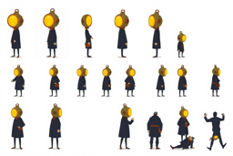 |

**Prompt**

```
character model sheet of one small original courier character repeated in twelve poses, arranged in a neat grid of 3 rows and 4 columns on a plain flat white background, every pose the same character and the same size, full body, side view facing right unless noted. The character: an oversized round brass oil-lamp for a head with a glowing warm yellow glass lens, a narrow dark navy long coat, thin dark legs, a small brown leather satchel on the left hip. Style: simple flat vector shapes, thick uniform dark outline, no gradients, no texture, limited palette of warm yellow, cream, navy, brown and near-black, clean readable silhouette, video game sprite reference. Poses in reading order: front view standing; side view standing; back view standing; relaxed idle; walking with legs apart at contact; walking with legs together passing; arm thrust forward casting a beam of light; flinching backwards hurt; both arms raised cheering; radiant power pose with a large glow halo; collapsed lying on the ground with the lamp dimmed; triumphant victory pose. No text, no letters, no numbers, no labels, no watermark, no background scenery.
```

**Negative prompt**

```
N/A — FLUX.1-schnell is guidance-distilled and mflux does not accept a negative prompt for it; exclusions (text, labels, scenery, gradients) are written into the positive prompt.
```

### ART-PC-01-20260929T204341Z-s37

| Field | Value |
|---|---|
| Created (UTC) | 2026-09-29T20:49:55+00:00 |
| Model / version | black-forest-labs/FLUX.1-schnell / mflux 0.20.0, 4-bit |
| Runtime | local — arm64 macOS 26.6.2 (Apple M4 Pro, 16 GB) |
| Licence / terms | Apache-2.0 (FLUX.1-schnell weights); outputs usable without restriction |
| Settings | `{"seed": 37, "width": 1536, "height": 1024, "steps": 4, "quantize": 4, "seconds": 374.0}` |
| Storyboard panels | P1, P2, P3, P4, P5, P6, P7, P8, P9 |
| Decision | **reject** by Bao Xing at 2026-09-29T20:53:50+00:00 |
| Reason | Bao 2026-09-29: rendered as a shaded, 3D-looking illustration instead of 2D pixel art ("不用3d就是2d像素游戏"); FLUX also ignored the 3x4 grid and drew mostly standing poses. Also scattered layout with inconsistent figure sizes. |
| Manual edits | — |
| Project files | — |
| Thumbnail | 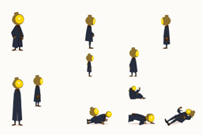 |

**Prompt**

```
character model sheet of one small original courier character repeated in twelve poses, arranged in a neat grid of 3 rows and 4 columns on a plain flat white background, every pose the same character and the same size, full body, side view facing right unless noted. The character: an oversized round brass oil-lamp for a head with a glowing warm yellow glass lens, a narrow dark navy long coat, thin dark legs, a small brown leather satchel on the left hip. Style: simple flat vector shapes, thick uniform dark outline, no gradients, no texture, limited palette of warm yellow, cream, navy, brown and near-black, clean readable silhouette, video game sprite reference. Poses in reading order: front view standing; side view standing; back view standing; relaxed idle; walking with legs apart at contact; walking with legs together passing; arm thrust forward casting a beam of light; flinching backwards hurt; both arms raised cheering; radiant power pose with a large glow halo; collapsed lying on the ground with the lamp dimmed; triumphant victory pose. No text, no letters, no numbers, no labels, no watermark, no background scenery.
```

**Negative prompt**

```
N/A — FLUX.1-schnell is guidance-distilled and mflux does not accept a negative prompt for it; exclusions (text, labels, scenery, gradients) are written into the positive prompt.
```

### ART-PC-01-20260929T205508Z-s11-idle

| Field | Value |
|---|---|
| Created (UTC) | 2026-09-29T20:55:50+00:00 |
| Model / version | black-forest-labs/FLUX.1-schnell / mflux 0.20.0 (Python API), 4-bit |
| Runtime | local — arm64 macOS 26.6.2 (Apple M4 Pro, 16 GB) |
| Licence / terms | Apache-2.0 (FLUX.1-schnell weights); outputs usable without restriction |
| Settings | `{"seed": 11, "width": 512, "height": 512, "steps": 4, "quantize": 4, "seconds": 41.8, "pose": "idle"}` |
| Storyboard panels | P1, P2, P3, P4, P5, P6, P7, P8, P9 |
| Decision | **reject** by Bao Xing at 2026-09-30T00:41:38+00:00 |
| Reason | Superseded: earlier prompt without 'bright golden brass' gave a brown housing that maps off-palette. |
| Manual edits | — |
| Project files | — |
| Thumbnail | 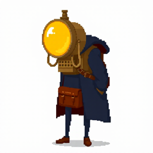 |

**Prompt**

```
16-bit pixel art video game sprite of one small original character: a courier whose head is an oversized round brass oil lamp with a glowing warm yellow glass lens and a small spout on top, wearing a long dark navy coat, thin dark legs and a small brown leather satchel on the hip. Side view facing right, standing relaxed, arms hanging at the sides. Full body, one single character centered, plain flat white background, crisp hard-edged square pixels, flat 2D colours, limited palette of warm yellow, cream, navy, brown and near-black, 1-pixel dark outline, no 3D rendering, no shading, no gradients, no anti-aliasing, no text, no letters, no watermark
```

**Negative prompt**

```
N/A — FLUX.1-schnell is guidance-distilled; mflux accepts no negative prompt for it. Exclusions (3D shading, gradients, text, background) are written into the positive prompt.
```

### ART-PC-01-20260929T205716Z-s11-turn_front

| Field | Value |
|---|---|
| Created (UTC) | 2026-09-29T20:58:00+00:00 |
| Model / version | black-forest-labs/FLUX.1-schnell / mflux 0.20.0 (Python API), 4-bit |
| Runtime | local — arm64 macOS 26.6.2 (Apple M4 Pro, 16 GB) |
| Licence / terms | Apache-2.0 (FLUX.1-schnell weights); outputs usable without restriction |
| Settings | `{"seed": 11, "width": 512, "height": 512, "steps": 4, "quantize": 4, "seconds": 44.7, "pose": "turn_front"}` |
| Storyboard panels | P1, P2, P3, P4, P5, P6, P7, P8, P9 |
| Decision | **modify** by Bao Xing at 2026-09-30T00:41:38+00:00 |
| Reason | Chosen for turn_front: large gold lamp, clear front view; s23 figure too small. |
| Manual edits | keyed white bg + grey shadow; mirrored to face right where the lens faced left; scaled so the lamp is 12 px (CHARACTER-SHEET rule 11-13 px), feet on the bottom row, coat centred; reduced 4x-supersampled to 32x32; locked to the 5-colour character palette in Lab space; 1-px ink outline |
| Project files | godot/assets/art/pc_sheet.png |
| Thumbnail |  |

**Processing (every edit, in order)**

1. `{"utc": "2026-09-30T00:41:52+00:00", "tool": "gen/art_process.py", "mapping": "gen/mappings/ART-PC-01.json", "frame": "turn_front", "out": "godot/assets/art/pc_sheet.png", "index": 0, "mirror": false, "recolor": null, "lamp_px": 12.0, "frame_px": [32, 32], "palette": "character", "supersample": 4, "outline": true}`

**Prompt**

```
16-bit pixel art video game sprite of one small original character: a courier whose head is an oversized round bright golden brass oil lamp with a glowing warm yellow glass lens and a small spout on top, wearing a long dark navy coat, thin dark legs and a small brown leather satchel on the hip. Front view, standing straight and facing the viewer, arms at the sides. Full body, one single character centered, plain flat white background, crisp hard-edged square pixels, flat 2D colours, limited palette of warm yellow, cream, navy, brown and near-black, 1-pixel dark outline, no 3D rendering, no shading, no gradients, no anti-aliasing, no text, no letters, no watermark
```

**Negative prompt**

```
N/A — FLUX.1-schnell is guidance-distilled; mflux accepts no negative prompt for it. Exclusions (3D shading, gradients, text, background) are written into the positive prompt.
```

### ART-PC-01-20260929T205800Z-s23-turn_front

| Field | Value |
|---|---|
| Created (UTC) | 2026-09-29T20:58:37+00:00 |
| Model / version | black-forest-labs/FLUX.1-schnell / mflux 0.20.0 (Python API), 4-bit |
| Runtime | local — arm64 macOS 26.6.2 (Apple M4 Pro, 16 GB) |
| Licence / terms | Apache-2.0 (FLUX.1-schnell weights); outputs usable without restriction |
| Settings | `{"seed": 23, "width": 512, "height": 512, "steps": 4, "quantize": 4, "seconds": 36.4, "pose": "turn_front"}` |
| Storyboard panels | P1, P2, P3, P4, P5, P6, P7, P8, P9 |
| Decision | **reject** by Bao Xing at 2026-09-30T00:41:38+00:00 |
| Reason | Figure too small in frame; lamp detail lost at 32 px. |
| Manual edits | — |
| Project files | — |
| Thumbnail | 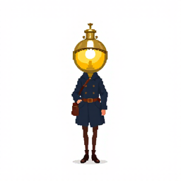 |

**Prompt**

```
16-bit pixel art video game sprite of one small original character: a courier whose head is an oversized round bright golden brass oil lamp with a glowing warm yellow glass lens and a small spout on top, wearing a long dark navy coat, thin dark legs and a small brown leather satchel on the hip. Front view, standing straight and facing the viewer, arms at the sides. Full body, one single character centered, plain flat white background, crisp hard-edged square pixels, flat 2D colours, limited palette of warm yellow, cream, navy, brown and near-black, 1-pixel dark outline, no 3D rendering, no shading, no gradients, no anti-aliasing, no text, no letters, no watermark
```

**Negative prompt**

```
N/A — FLUX.1-schnell is guidance-distilled; mflux accepts no negative prompt for it. Exclusions (3D shading, gradients, text, background) are written into the positive prompt.
```

### ART-PC-01-20260929T205837Z-s11-idle

| Field | Value |
|---|---|
| Created (UTC) | 2026-09-29T20:59:52+00:00 |
| Model / version | black-forest-labs/FLUX.1-schnell / mflux 0.20.0 (Python API), 4-bit |
| Runtime | local — arm64 macOS 26.6.2 (Apple M4 Pro, 16 GB) |
| Licence / terms | Apache-2.0 (FLUX.1-schnell weights); outputs usable without restriction |
| Settings | `{"seed": 11, "width": 512, "height": 512, "steps": 4, "quantize": 4, "seconds": 75.8, "pose": "idle"}` |
| Storyboard panels | P1, P2, P3, P4, P5, P6, P7, P8, P9 |
| Decision | **modify** by Bao Xing at 2026-09-30T00:41:38+00:00 |
| Reason | Chosen for idle: 'bright golden brass' prompt keeps the housing gold, matches the palette. |
| Manual edits | keyed white bg + grey shadow; mirrored to face right where the lens faced left; scaled so the lamp is 12 px (CHARACTER-SHEET rule 11-13 px), feet on the bottom row, coat centred; reduced 4x-supersampled to 32x32; locked to the 5-colour character palette in Lab space; 1-px ink outline |
| Project files | godot/assets/art/pc_sheet.png |
| Thumbnail |  |

**Processing (every edit, in order)**

1. `{"utc": "2026-09-30T00:41:52+00:00", "tool": "gen/art_process.py", "mapping": "gen/mappings/ART-PC-01.json", "frame": "idle", "out": "godot/assets/art/pc_sheet.png", "index": 1, "mirror": true, "recolor": null, "lamp_px": 12.0, "frame_px": [32, 32], "palette": "character", "supersample": 4, "outline": true}`

**Prompt**

```
16-bit pixel art video game sprite of one small original character: a courier whose head is an oversized round bright golden brass oil lamp with a glowing warm yellow glass lens and a small spout on top, wearing a long dark navy coat, thin dark legs and a small brown leather satchel on the hip. Side view facing right, standing relaxed, arms hanging at the sides. Full body, one single character centered, plain flat white background, crisp hard-edged square pixels, flat 2D colours, limited palette of warm yellow, cream, navy, brown and near-black, 1-pixel dark outline, no 3D rendering, no shading, no gradients, no anti-aliasing, no text, no letters, no watermark
```

**Negative prompt**

```
N/A — FLUX.1-schnell is guidance-distilled; mflux accepts no negative prompt for it. Exclusions (3D shading, gradients, text, background) are written into the positive prompt.
```

### ART-PC-01-20260929T205952Z-s23-idle

| Field | Value |
|---|---|
| Created (UTC) | 2026-09-29T21:01:17+00:00 |
| Model / version | black-forest-labs/FLUX.1-schnell / mflux 0.20.0 (Python API), 4-bit |
| Runtime | local — arm64 macOS 26.6.2 (Apple M4 Pro, 16 GB) |
| Licence / terms | Apache-2.0 (FLUX.1-schnell weights); outputs usable without restriction |
| Settings | `{"seed": 23, "width": 512, "height": 512, "steps": 4, "quantize": 4, "seconds": 84.6, "pose": "idle"}` |
| Storyboard panels | P1, P2, P3, P4, P5, P6, P7, P8, P9 |
| Decision | **reject** by Bao Xing at 2026-09-30T00:41:38+00:00 |
| Reason | Diving-helmet look and small figure; inconsistent with the s11 set. |
| Manual edits | — |
| Project files | — |
| Thumbnail | 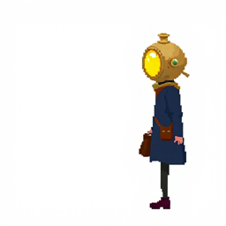 |

**Prompt**

```
16-bit pixel art video game sprite of one small original character: a courier whose head is an oversized round bright golden brass oil lamp with a glowing warm yellow glass lens and a small spout on top, wearing a long dark navy coat, thin dark legs and a small brown leather satchel on the hip. Side view facing right, standing relaxed, arms hanging at the sides. Full body, one single character centered, plain flat white background, crisp hard-edged square pixels, flat 2D colours, limited palette of warm yellow, cream, navy, brown and near-black, 1-pixel dark outline, no 3D rendering, no shading, no gradients, no anti-aliasing, no text, no letters, no watermark
```

**Negative prompt**

```
N/A — FLUX.1-schnell is guidance-distilled; mflux accepts no negative prompt for it. Exclusions (3D shading, gradients, text, background) are written into the positive prompt.
```

### ART-PC-01-20260929T210117Z-s11-walk_contact

| Field | Value |
|---|---|
| Created (UTC) | 2026-09-29T21:03:01+00:00 |
| Model / version | black-forest-labs/FLUX.1-schnell / mflux 0.20.0 (Python API), 4-bit |
| Runtime | local — arm64 macOS 26.6.2 (Apple M4 Pro, 16 GB) |
| Licence / terms | Apache-2.0 (FLUX.1-schnell weights); outputs usable without restriction |
| Settings | `{"seed": 11, "width": 512, "height": 512, "steps": 4, "quantize": 4, "seconds": 104.1, "pose": "walk_contact"}` |
| Storyboard panels | P1, P2, P3, P4, P5, P6, P7, P8, P9 |
| Decision | **modify** by Bao Xing at 2026-09-30T00:41:38+00:00 |
| Reason | Chosen for walk_contact: legs apart, same identity as the other s11 frames. |
| Manual edits | keyed white bg + grey shadow; mirrored to face right where the lens faced left; scaled so the lamp is 12 px (CHARACTER-SHEET rule 11-13 px), feet on the bottom row, coat centred; reduced 4x-supersampled to 32x32; locked to the 5-colour character palette in Lab space; 1-px ink outline |
| Project files | godot/assets/art/pc_sheet.png |
| Thumbnail |  |

**Processing (every edit, in order)**

1. `{"utc": "2026-09-30T00:41:52+00:00", "tool": "gen/art_process.py", "mapping": "gen/mappings/ART-PC-01.json", "frame": "walk_contact", "out": "godot/assets/art/pc_sheet.png", "index": 2, "mirror": true, "recolor": null, "lamp_px": 12.0, "frame_px": [32, 32], "palette": "character", "supersample": 4, "outline": true}`

**Prompt**

```
16-bit pixel art video game sprite of one small original character: a courier whose head is an oversized round bright golden brass oil lamp with a glowing warm yellow glass lens and a small spout on top, wearing a long dark navy coat, thin dark legs and a small brown leather satchel on the hip. Side view facing right, walking mid-stride, front leg forward and back leg behind, legs wide apart. Full body, one single character centered, plain flat white background, crisp hard-edged square pixels, flat 2D colours, limited palette of warm yellow, cream, navy, brown and near-black, 1-pixel dark outline, no 3D rendering, no shading, no gradients, no anti-aliasing, no text, no letters, no watermark
```

**Negative prompt**

```
N/A — FLUX.1-schnell is guidance-distilled; mflux accepts no negative prompt for it. Exclusions (3D shading, gradients, text, background) are written into the positive prompt.
```

### ART-PC-01-20260929T210301Z-s23-walk_contact

| Field | Value |
|---|---|
| Created (UTC) | 2026-09-29T21:03:54+00:00 |
| Model / version | black-forest-labs/FLUX.1-schnell / mflux 0.20.0 (Python API), 4-bit |
| Runtime | local — arm64 macOS 26.6.2 (Apple M4 Pro, 16 GB) |
| Licence / terms | Apache-2.0 (FLUX.1-schnell weights); outputs usable without restriction |
| Settings | `{"seed": 23, "width": 512, "height": 512, "steps": 4, "quantize": 4, "seconds": 53.2, "pose": "walk_contact"}` |
| Storyboard panels | P1, P2, P3, P4, P5, P6, P7, P8, P9 |
| Decision | **reject** by Bao Xing at 2026-09-30T00:41:38+00:00 |
| Reason | Drew an extra floating lamp beside the character. |
| Manual edits | — |
| Project files | — |
| Thumbnail | 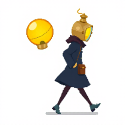 |

**Prompt**

```
16-bit pixel art video game sprite of one small original character: a courier whose head is an oversized round bright golden brass oil lamp with a glowing warm yellow glass lens and a small spout on top, wearing a long dark navy coat, thin dark legs and a small brown leather satchel on the hip. Side view facing right, walking mid-stride, front leg forward and back leg behind, legs wide apart. Full body, one single character centered, plain flat white background, crisp hard-edged square pixels, flat 2D colours, limited palette of warm yellow, cream, navy, brown and near-black, 1-pixel dark outline, no 3D rendering, no shading, no gradients, no anti-aliasing, no text, no letters, no watermark
```

**Negative prompt**

```
N/A — FLUX.1-schnell is guidance-distilled; mflux accepts no negative prompt for it. Exclusions (3D shading, gradients, text, background) are written into the positive prompt.
```

### ART-PC-01-20260929T210354Z-s11-walk_passing

| Field | Value |
|---|---|
| Created (UTC) | 2026-09-29T21:09:39+00:00 |
| Model / version | black-forest-labs/FLUX.1-schnell / mflux 0.20.0 (Python API), 4-bit |
| Runtime | local — arm64 macOS 26.6.2 (Apple M4 Pro, 16 GB) |
| Licence / terms | Apache-2.0 (FLUX.1-schnell weights); outputs usable without restriction |
| Settings | `{"seed": 11, "width": 512, "height": 512, "steps": 4, "quantize": 4, "seconds": 345.1, "pose": "walk_passing"}` |
| Storyboard panels | P1, P2, P3, P4, P5, P6, P7, P8, P9 |
| Decision | **modify** by Bao Xing at 2026-09-30T00:41:38+00:00 |
| Reason | Chosen for walk_passing: knee raised, reads as the second walk frame. |
| Manual edits | keyed white bg + grey shadow; mirrored to face right where the lens faced left; scaled so the lamp is 12 px (CHARACTER-SHEET rule 11-13 px), feet on the bottom row, coat centred; reduced 4x-supersampled to 32x32; locked to the 5-colour character palette in Lab space; 1-px ink outline |
| Project files | godot/assets/art/pc_sheet.png |
| Thumbnail |  |

**Processing (every edit, in order)**

1. `{"utc": "2026-09-30T00:41:52+00:00", "tool": "gen/art_process.py", "mapping": "gen/mappings/ART-PC-01.json", "frame": "walk_passing", "out": "godot/assets/art/pc_sheet.png", "index": 3, "mirror": true, "recolor": null, "lamp_px": 12.0, "frame_px": [32, 32], "palette": "character", "supersample": 4, "outline": true}`

**Prompt**

```
16-bit pixel art video game sprite of one small original character: a courier whose head is an oversized round bright golden brass oil lamp with a glowing warm yellow glass lens and a small spout on top, wearing a long dark navy coat, thin dark legs and a small brown leather satchel on the hip. Side view facing right, walking, one knee raised, legs passing each other. Full body, one single character centered, plain flat white background, crisp hard-edged square pixels, flat 2D colours, limited palette of warm yellow, cream, navy, brown and near-black, 1-pixel dark outline, no 3D rendering, no shading, no gradients, no anti-aliasing, no text, no letters, no watermark
```

**Negative prompt**

```
N/A — FLUX.1-schnell is guidance-distilled; mflux accepts no negative prompt for it. Exclusions (3D shading, gradients, text, background) are written into the positive prompt.
```

### ART-PC-01-20260929T210939Z-s23-walk_passing

| Field | Value |
|---|---|
| Created (UTC) | 2026-09-29T21:34:45+00:00 |
| Model / version | black-forest-labs/FLUX.1-schnell / mflux 0.20.0 (Python API), 4-bit |
| Runtime | local — arm64 macOS 26.6.2 (Apple M4 Pro, 16 GB) |
| Licence / terms | Apache-2.0 (FLUX.1-schnell weights); outputs usable without restriction |
| Settings | `{"seed": 23, "width": 512, "height": 512, "steps": 4, "quantize": 4, "seconds": 1505.8, "pose": "walk_passing"}` |
| Storyboard panels | P1, P2, P3, P4, P5, P6, P7, P8, P9 |
| Decision | **reject** by Bao Xing at 2026-09-30T00:41:38+00:00 |
| Reason | Drew an extra lamp on a stand beside the character. |
| Manual edits | — |
| Project files | — |
| Thumbnail | 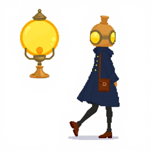 |

**Prompt**

```
16-bit pixel art video game sprite of one small original character: a courier whose head is an oversized round bright golden brass oil lamp with a glowing warm yellow glass lens and a small spout on top, wearing a long dark navy coat, thin dark legs and a small brown leather satchel on the hip. Side view facing right, walking, one knee raised, legs passing each other. Full body, one single character centered, plain flat white background, crisp hard-edged square pixels, flat 2D colours, limited palette of warm yellow, cream, navy, brown and near-black, 1-pixel dark outline, no 3D rendering, no shading, no gradients, no anti-aliasing, no text, no letters, no watermark
```

**Negative prompt**

```
N/A — FLUX.1-schnell is guidance-distilled; mflux accepts no negative prompt for it. Exclusions (3D shading, gradients, text, background) are written into the positive prompt.
```

### ART-PC-01-20260929T213445Z-s11-cast

| Field | Value |
|---|---|
| Created (UTC) | 2026-09-29T23:25:06+00:00 |
| Model / version | black-forest-labs/FLUX.1-schnell / mflux 0.20.0 (Python API), 4-bit |
| Runtime | local — arm64 macOS 26.6.2 (Apple M4 Pro, 16 GB) |
| Licence / terms | Apache-2.0 (FLUX.1-schnell weights); outputs usable without restriction |
| Settings | `{"seed": 11, "width": 512, "height": 512, "steps": 4, "quantize": 4, "seconds": 6620.6, "pose": "cast"}` |
| Storyboard panels | P1, P2, P3, P4, P5, P6, P7, P8, P9 |
| Decision | **modify** by Bao Xing at 2026-09-30T00:41:38+00:00 |
| Reason | Chosen for cast: arm thrust forward, reads as casting. |
| Manual edits | keyed white bg + grey shadow; mirrored to face right where the lens faced left; scaled so the lamp is 12 px (CHARACTER-SHEET rule 11-13 px), feet on the bottom row, coat centred; reduced 4x-supersampled to 32x32; locked to the 5-colour character palette in Lab space; 1-px ink outline |
| Project files | godot/assets/art/pc_sheet.png |
| Thumbnail |  |

**Processing (every edit, in order)**

1. `{"utc": "2026-09-30T00:41:52+00:00", "tool": "gen/art_process.py", "mapping": "gen/mappings/ART-PC-01.json", "frame": "cast", "out": "godot/assets/art/pc_sheet.png", "index": 4, "mirror": true, "recolor": null, "lamp_px": 12.0, "frame_px": [32, 32], "palette": "character", "supersample": 4, "outline": true}`

**Prompt**

```
16-bit pixel art video game sprite of one small original character: a courier whose head is an oversized round bright golden brass oil lamp with a glowing warm yellow glass lens and a small spout on top, wearing a long dark navy coat, thin dark legs and a small brown leather satchel on the hip. Side view facing right, one arm stretched straight forward, pointing and casting light. Full body, one single character centered, plain flat white background, crisp hard-edged square pixels, flat 2D colours, limited palette of warm yellow, cream, navy, brown and near-black, 1-pixel dark outline, no 3D rendering, no shading, no gradients, no anti-aliasing, no text, no letters, no watermark
```

**Negative prompt**

```
N/A — FLUX.1-schnell is guidance-distilled; mflux accepts no negative prompt for it. Exclusions (3D shading, gradients, text, background) are written into the positive prompt.
```

### ART-PC-01-20260930T002916Z-s23-cast

| Field | Value |
|---|---|
| Created (UTC) | 2026-09-30T00:29:52+00:00 |
| Model / version | black-forest-labs/FLUX.1-schnell / mflux 0.20.0 (Python API); 4-bit copy saved locally with mflux-save from FLUX.1-schnell @ 741f7c3 |
| Runtime | local — arm64 macOS 26.6.2 (Apple M4 Pro, 16 GB) |
| Licence / terms | Apache-2.0 (FLUX.1-schnell weights); outputs usable without restriction |
| Settings | `{"seed": 23, "width": 512, "height": 512, "steps": 4, "quantize": 4, "seconds": 35.7, "peak_gb": 12.75, "pose": "cast"}` |
| Storyboard panels | P1, P2, P3, P4, P5, P6, P7, P8, P9 |
| Decision | **reject** by Bao Xing at 2026-09-30T00:41:38+00:00 |
| Reason | Extra floating orb and a green lens; off-identity. |
| Manual edits | — |
| Project files | — |
| Thumbnail | 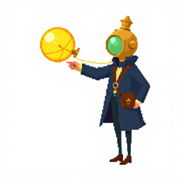 |

**Prompt**

```
16-bit pixel art video game sprite of one small original character: a courier whose head is an oversized round bright golden brass oil lamp with a glowing warm yellow glass lens and a small spout on top, wearing a long dark navy coat, thin dark legs and a small brown leather satchel on the hip. Side view facing right, one arm stretched straight forward, pointing and casting light. Full body, one single character centered, plain flat white background, crisp hard-edged square pixels, flat 2D colours, limited palette of warm yellow, cream, navy, brown and near-black, 1-pixel dark outline, no 3D rendering, no shading, no gradients, no anti-aliasing, no text, no letters, no watermark
```

**Negative prompt**

```
N/A — FLUX.1-schnell is guidance-distilled; mflux accepts no negative prompt for it. Exclusions (3D shading, gradients, text, background) are written into the positive prompt.
```

### ART-PC-01-20260930T002952Z-s23-hurt

| Field | Value |
|---|---|
| Created (UTC) | 2026-09-30T00:30:50+00:00 |
| Model / version | black-forest-labs/FLUX.1-schnell / mflux 0.20.0 (Python API); 4-bit copy saved locally with mflux-save from FLUX.1-schnell @ 741f7c3 |
| Runtime | local — arm64 macOS 26.6.2 (Apple M4 Pro, 16 GB) |
| Licence / terms | Apache-2.0 (FLUX.1-schnell weights); outputs usable without restriction |
| Settings | `{"seed": 23, "width": 512, "height": 512, "steps": 4, "quantize": 4, "seconds": 57.7, "peak_gb": 12.75, "pose": "hurt"}` |
| Storyboard panels | P1, P2, P3, P4, P5, P6, P7, P8, P9 |
| Decision | **modify** by Bao Xing at 2026-09-30T00:41:38+00:00 |
| Reason | Chosen for hurt: leaning back with a leg lifted, the clearest recoil. |
| Manual edits | keyed white bg + grey shadow; mirrored to face right where the lens faced left; scaled so the lamp is 12 px (CHARACTER-SHEET rule 11-13 px), feet on the bottom row, coat centred; reduced 4x-supersampled to 32x32; locked to the 5-colour character palette in Lab space; 1-px ink outline |
| Project files | godot/assets/art/pc_sheet.png |
| Thumbnail | 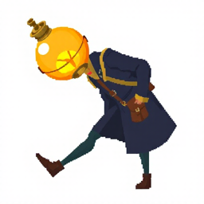 |

**Processing (every edit, in order)**

1. `{"utc": "2026-09-30T00:41:52+00:00", "tool": "gen/art_process.py", "mapping": "gen/mappings/ART-PC-01.json", "frame": "hurt", "out": "godot/assets/art/pc_sheet.png", "index": 5, "mirror": true, "recolor": null, "lamp_px": 12.0, "frame_px": [32, 32], "palette": "character", "supersample": 4, "outline": true}`

**Prompt**

```
16-bit pixel art video game sprite of one small original character: a courier whose head is an oversized round bright golden brass oil lamp with a glowing warm yellow glass lens and a small spout on top, wearing a long dark navy coat, thin dark legs and a small brown leather satchel on the hip. Side view facing right, recoiling backwards in pain, leaning back, one leg lifted. Full body, one single character centered, plain flat white background, crisp hard-edged square pixels, flat 2D colours, limited palette of warm yellow, cream, navy, brown and near-black, 1-pixel dark outline, no 3D rendering, no shading, no gradients, no anti-aliasing, no text, no letters, no watermark
```

**Negative prompt**

```
N/A — FLUX.1-schnell is guidance-distilled; mflux accepts no negative prompt for it. Exclusions (3D shading, gradients, text, background) are written into the positive prompt.
```

### ART-PC-01-20260930T003050Z-s23-levelup

| Field | Value |
|---|---|
| Created (UTC) | 2026-09-30T00:32:00+00:00 |
| Model / version | black-forest-labs/FLUX.1-schnell / mflux 0.20.0 (Python API); 4-bit copy saved locally with mflux-save from FLUX.1-schnell @ 741f7c3 |
| Runtime | local — arm64 macOS 26.6.2 (Apple M4 Pro, 16 GB) |
| Licence / terms | Apache-2.0 (FLUX.1-schnell weights); outputs usable without restriction |
| Settings | `{"seed": 23, "width": 512, "height": 512, "steps": 4, "quantize": 4, "seconds": 70.6, "peak_gb": 12.76, "pose": "levelup"}` |
| Storyboard panels | P1, P2, P3, P4, P5, P6, P7, P8, P9 |
| Decision | **reject** by Bao Xing at 2026-09-30T00:41:38+00:00 |
| Reason | Figure too small; the raised arms vanish at 32 px. |
| Manual edits | — |
| Project files | — |
| Thumbnail |  |

**Prompt**

```
16-bit pixel art video game sprite of one small original character: a courier whose head is an oversized round bright golden brass oil lamp with a glowing warm yellow glass lens and a small spout on top, wearing a long dark navy coat, thin dark legs and a small brown leather satchel on the hip. Side view facing right, cheering with both arms raised high above the head. Full body, one single character centered, plain flat white background, crisp hard-edged square pixels, flat 2D colours, limited palette of warm yellow, cream, navy, brown and near-black, 1-pixel dark outline, no 3D rendering, no shading, no gradients, no anti-aliasing, no text, no letters, no watermark
```

**Negative prompt**

```
N/A — FLUX.1-schnell is guidance-distilled; mflux accepts no negative prompt for it. Exclusions (3D shading, gradients, text, background) are written into the positive prompt.
```

### ART-PC-01-20260930T003238Z-s11-hurt

| Field | Value |
|---|---|
| Created (UTC) | 2026-09-30T00:33:14+00:00 |
| Model / version | black-forest-labs/FLUX.1-schnell / mflux 0.20.0 (Python API); 4-bit copy saved locally with mflux-save from FLUX.1-schnell @ 741f7c3 |
| Runtime | local — arm64 macOS 26.6.2 (Apple M4 Pro, 16 GB) |
| Licence / terms | Apache-2.0 (FLUX.1-schnell weights); outputs usable without restriction |
| Settings | `{"seed": 11, "width": 512, "height": 512, "steps": 4, "quantize": 4, "seconds": 36.0, "peak_gb": 12.75, "pose": "hurt"}` |
| Storyboard panels | P1, P2, P3, P4, P5, P6, P7, P8, P9 |
| Decision | **reject** by Bao Xing at 2026-09-30T00:41:38+00:00 |
| Reason | Recoil less readable than the s23 hurt at 32 px. |
| Manual edits | — |
| Project files | — |
| Thumbnail |  |

**Prompt**

```
16-bit pixel art video game sprite of one small original character: a courier whose head is an oversized round bright golden brass oil lamp with a glowing warm yellow glass lens and a small spout on top, wearing a long dark navy coat, thin dark legs and a small brown leather satchel on the hip. Side view facing right, recoiling backwards in pain, leaning back, one leg lifted. Full body, one single character centered, plain flat white background, crisp hard-edged square pixels, flat 2D colours, limited palette of warm yellow, cream, navy, brown and near-black, 1-pixel dark outline, no 3D rendering, no shading, no gradients, no anti-aliasing, no text, no letters, no watermark
```

**Negative prompt**

```
N/A — FLUX.1-schnell is guidance-distilled; mflux accepts no negative prompt for it. Exclusions (3D shading, gradients, text, background) are written into the positive prompt.
```

### ART-PC-01-20260930T003317Z-s11-levelup

| Field | Value |
|---|---|
| Created (UTC) | 2026-09-30T00:33:55+00:00 |
| Model / version | black-forest-labs/FLUX.1-schnell / mflux 0.20.0 (Python API); 4-bit copy saved locally with mflux-save from FLUX.1-schnell @ 741f7c3 |
| Runtime | local — arm64 macOS 26.6.2 (Apple M4 Pro, 16 GB) |
| Licence / terms | Apache-2.0 (FLUX.1-schnell weights); outputs usable without restriction |
| Settings | `{"seed": 11, "width": 512, "height": 512, "steps": 4, "quantize": 4, "seconds": 37.5, "peak_gb": 12.75, "pose": "levelup"}` |
| Storyboard panels | P1, P2, P3, P4, P5, P6, P7, P8, P9 |
| Decision | **modify** by Bao Xing at 2026-09-30T00:41:38+00:00 |
| Reason | Chosen for levelup: raised arm and big lamp read at 32 px; s23 figure too small. |
| Manual edits | keyed white bg + grey shadow; mirrored to face right where the lens faced left; scaled so the lamp is 12 px (CHARACTER-SHEET rule 11-13 px), feet on the bottom row, coat centred; reduced 4x-supersampled to 32x32; locked to the 5-colour character palette in Lab space; 1-px ink outline |
| Project files | godot/assets/art/pc_sheet.png |
| Thumbnail |  |

**Processing (every edit, in order)**

1. `{"utc": "2026-09-30T00:41:52+00:00", "tool": "gen/art_process.py", "mapping": "gen/mappings/ART-PC-01.json", "frame": "levelup", "out": "godot/assets/art/pc_sheet.png", "index": 6, "mirror": true, "recolor": null, "lamp_px": 12.0, "frame_px": [32, 32], "palette": "character", "supersample": 4, "outline": true}`

**Prompt**

```
16-bit pixel art video game sprite of one small original character: a courier whose head is an oversized round bright golden brass oil lamp with a glowing warm yellow glass lens and a small spout on top, wearing a long dark navy coat, thin dark legs and a small brown leather satchel on the hip. Side view facing right, cheering with both arms raised high above the head. Full body, one single character centered, plain flat white background, crisp hard-edged square pixels, flat 2D colours, limited palette of warm yellow, cream, navy, brown and near-black, 1-pixel dark outline, no 3D rendering, no shading, no gradients, no anti-aliasing, no text, no letters, no watermark
```

**Negative prompt**

```
N/A — FLUX.1-schnell is guidance-distilled; mflux accepts no negative prompt for it. Exclusions (3D shading, gradients, text, background) are written into the positive prompt.
```

### ART-PC-01-20260930T003358Z-s11-sunflare

| Field | Value |
|---|---|
| Created (UTC) | 2026-09-30T00:34:37+00:00 |
| Model / version | black-forest-labs/FLUX.1-schnell / mflux 0.20.0 (Python API); 4-bit copy saved locally with mflux-save from FLUX.1-schnell @ 741f7c3 |
| Runtime | local — arm64 macOS 26.6.2 (Apple M4 Pro, 16 GB) |
| Licence / terms | Apache-2.0 (FLUX.1-schnell weights); outputs usable without restriction |
| Settings | `{"seed": 11, "width": 512, "height": 512, "steps": 4, "quantize": 4, "seconds": 39.4, "peak_gb": 12.75, "pose": "sunflare"}` |
| Storyboard panels | P1, P2, P3, P4, P5, P6, P7, P8, P9 |
| Decision | **modify** by Bao Xing at 2026-09-30T00:41:38+00:00 |
| Reason | Chosen for sunflare: arms spread wide around a big glowing lamp. |
| Manual edits | keyed white bg + grey shadow; mirrored to face right where the lens faced left; scaled so the lamp is 12 px (CHARACTER-SHEET rule 11-13 px), feet on the bottom row, coat centred; reduced 4x-supersampled to 32x32; locked to the 5-colour character palette in Lab space; 1-px ink outline |
| Project files | godot/assets/art/pc_sheet.png |
| Thumbnail |  |

**Processing (every edit, in order)**

1. `{"utc": "2026-09-30T00:41:52+00:00", "tool": "gen/art_process.py", "mapping": "gen/mappings/ART-PC-01.json", "frame": "sunflare", "out": "godot/assets/art/pc_sheet.png", "index": 7, "mirror": true, "recolor": null, "lamp_px": 12.0, "frame_px": [32, 32], "palette": "character", "supersample": 4, "outline": true}`

**Prompt**

```
16-bit pixel art video game sprite of one small original character: a courier whose head is an oversized round bright golden brass oil lamp with a glowing warm yellow glass lens and a small spout on top, wearing a long dark navy coat, thin dark legs and a small brown leather satchel on the hip. Side view facing right, arms spread wide to both sides, the lamp head blazing with bright rays of light. Full body, one single character centered, plain flat white background, crisp hard-edged square pixels, flat 2D colours, limited palette of warm yellow, cream, navy, brown and near-black, 1-pixel dark outline, no 3D rendering, no shading, no gradients, no anti-aliasing, no text, no letters, no watermark
```

**Negative prompt**

```
N/A — FLUX.1-schnell is guidance-distilled; mflux accepts no negative prompt for it. Exclusions (3D shading, gradients, text, background) are written into the positive prompt.
```

### ART-PC-01-20260930T003437Z-s23-sunflare

| Field | Value |
|---|---|
| Created (UTC) | 2026-09-30T00:35:21+00:00 |
| Model / version | black-forest-labs/FLUX.1-schnell / mflux 0.20.0 (Python API); 4-bit copy saved locally with mflux-save from FLUX.1-schnell @ 741f7c3 |
| Runtime | local — arm64 macOS 26.6.2 (Apple M4 Pro, 16 GB) |
| Licence / terms | Apache-2.0 (FLUX.1-schnell weights); outputs usable without restriction |
| Settings | `{"seed": 23, "width": 512, "height": 512, "steps": 4, "quantize": 4, "seconds": 43.7, "peak_gb": 12.75, "pose": "sunflare"}` |
| Storyboard panels | P1, P2, P3, P4, P5, P6, P7, P8, P9 |
| Decision | **reject** by Bao Xing at 2026-09-30T00:41:38+00:00 |
| Reason | Small figure, no spread-arms power pose. |
| Manual edits | — |
| Project files | — |
| Thumbnail |  |

**Prompt**

```
16-bit pixel art video game sprite of one small original character: a courier whose head is an oversized round bright golden brass oil lamp with a glowing warm yellow glass lens and a small spout on top, wearing a long dark navy coat, thin dark legs and a small brown leather satchel on the hip. Side view facing right, arms spread wide to both sides, the lamp head blazing with bright rays of light. Full body, one single character centered, plain flat white background, crisp hard-edged square pixels, flat 2D colours, limited palette of warm yellow, cream, navy, brown and near-black, 1-pixel dark outline, no 3D rendering, no shading, no gradients, no anti-aliasing, no text, no letters, no watermark
```

**Negative prompt**

```
N/A — FLUX.1-schnell is guidance-distilled; mflux accepts no negative prompt for it. Exclusions (3D shading, gradients, text, background) are written into the positive prompt.
```

### ART-PC-01-20260930T003525Z-s11-defeat

| Field | Value |
|---|---|
| Created (UTC) | 2026-09-30T00:36:14+00:00 |
| Model / version | black-forest-labs/FLUX.1-schnell / mflux 0.20.0 (Python API); 4-bit copy saved locally with mflux-save from FLUX.1-schnell @ 741f7c3 |
| Runtime | local — arm64 macOS 26.6.2 (Apple M4 Pro, 16 GB) |
| Licence / terms | Apache-2.0 (FLUX.1-schnell weights); outputs usable without restriction |
| Settings | `{"seed": 11, "width": 512, "height": 512, "steps": 4, "quantize": 4, "seconds": 49.6, "peak_gb": 12.75, "pose": "defeat"}` |
| Storyboard panels | P1, P2, P3, P4, P5, P6, P7, P8, P9 |
| Decision | **reject** by Bao Xing at 2026-09-30T00:41:38+00:00 |
| Reason | Reads as sitting, not collapsed. |
| Manual edits | — |
| Project files | — |
| Thumbnail |  |

**Prompt**

```
16-bit pixel art video game sprite of one small original character: a courier whose head is an oversized round bright golden brass oil lamp with a glowing warm yellow glass lens and a small spout on top, wearing a long dark navy coat, thin dark legs and a small brown leather satchel on the hip. Collapsed, lying flat on the ground on its side, the lamp head dark and unlit. Full body, one single character centered, plain flat white background, crisp hard-edged square pixels, flat 2D colours, limited palette of warm yellow, cream, navy, brown and near-black, 1-pixel dark outline, no 3D rendering, no shading, no gradients, no anti-aliasing, no text, no letters, no watermark
```

**Negative prompt**

```
N/A — FLUX.1-schnell is guidance-distilled; mflux accepts no negative prompt for it. Exclusions (3D shading, gradients, text, background) are written into the positive prompt.
```

### ART-PC-01-20260930T003614Z-s23-defeat

| Field | Value |
|---|---|
| Created (UTC) | 2026-09-30T00:37:16+00:00 |
| Model / version | black-forest-labs/FLUX.1-schnell / mflux 0.20.0 (Python API); 4-bit copy saved locally with mflux-save from FLUX.1-schnell @ 741f7c3 |
| Runtime | local — arm64 macOS 26.6.2 (Apple M4 Pro, 16 GB) |
| Licence / terms | Apache-2.0 (FLUX.1-schnell weights); outputs usable without restriction |
| Settings | `{"seed": 23, "width": 512, "height": 512, "steps": 4, "quantize": 4, "seconds": 61.7, "peak_gb": 12.75, "pose": "defeat"}` |
| Storyboard panels | P1, P2, P3, P4, P5, P6, P7, P8, P9 |
| Decision | **modify** by Bao Xing at 2026-09-30T00:41:38+00:00 |
| Reason | Chosen for defeat: lying flat reads as collapsed; FLUX left the lamp lit despite the prompt. |
| Manual edits | keyed white bg + grey shadow; mirrored to face right where the lens faced left; scaled so the lamp is 12 px (CHARACTER-SHEET rule 11-13 px), feet on the bottom row, coat centred; reduced 4x-supersampled to 32x32; locked to the 5-colour character palette in Lab space; 1-px ink outline; hand edit: lamp gold and cream recoloured to satchel brown so the lamp reads as out |
| Project files | godot/assets/art/pc_sheet.png |
| Thumbnail |  |

**Processing (every edit, in order)**

1. `{"utc": "2026-09-30T00:41:52+00:00", "tool": "gen/art_process.py", "mapping": "gen/mappings/ART-PC-01.json", "frame": "defeat", "out": "godot/assets/art/pc_sheet.png", "index": 8, "mirror": true, "recolor": {"#F2B84B": "#8A5A3C", "#FFF1C9": "#8A5A3C"}, "lamp_px": 12.0, "frame_px": [32, 32], "palette": "character", "supersample": 4, "outline": true}`

**Prompt**

```
16-bit pixel art video game sprite of one small original character: a courier whose head is an oversized round bright golden brass oil lamp with a glowing warm yellow glass lens and a small spout on top, wearing a long dark navy coat, thin dark legs and a small brown leather satchel on the hip. Collapsed, lying flat on the ground on its side, the lamp head dark and unlit. Full body, one single character centered, plain flat white background, crisp hard-edged square pixels, flat 2D colours, limited palette of warm yellow, cream, navy, brown and near-black, 1-pixel dark outline, no 3D rendering, no shading, no gradients, no anti-aliasing, no text, no letters, no watermark
```

**Negative prompt**

```
N/A — FLUX.1-schnell is guidance-distilled; mflux accepts no negative prompt for it. Exclusions (3D shading, gradients, text, background) are written into the positive prompt.
```

### ART-PC-01-20260930T003720Z-s11-victory

| Field | Value |
|---|---|
| Created (UTC) | 2026-09-30T00:38:17+00:00 |
| Model / version | black-forest-labs/FLUX.1-schnell / mflux 0.20.0 (Python API); 4-bit copy saved locally with mflux-save from FLUX.1-schnell @ 741f7c3 |
| Runtime | local — arm64 macOS 26.6.2 (Apple M4 Pro, 16 GB) |
| Licence / terms | Apache-2.0 (FLUX.1-schnell weights); outputs usable without restriction |
| Settings | `{"seed": 11, "width": 512, "height": 512, "steps": 4, "quantize": 4, "seconds": 56.9, "peak_gb": 12.75, "pose": "victory"}` |
| Storyboard panels | P1, P2, P3, P4, P5, P6, P7, P8, P9 |
| Decision | **modify** by Bao Xing at 2026-09-30T00:41:38+00:00 |
| Reason | Chosen for victory: fist raised, same identity as s11 set. |
| Manual edits | keyed white bg + grey shadow; mirrored to face right where the lens faced left; scaled so the lamp is 12 px (CHARACTER-SHEET rule 11-13 px), feet on the bottom row, coat centred; reduced 4x-supersampled to 32x32; locked to the 5-colour character palette in Lab space; 1-px ink outline |
| Project files | godot/assets/art/pc_sheet.png |
| Thumbnail |  |

**Processing (every edit, in order)**

1. `{"utc": "2026-09-30T00:41:52+00:00", "tool": "gen/art_process.py", "mapping": "gen/mappings/ART-PC-01.json", "frame": "victory", "out": "godot/assets/art/pc_sheet.png", "index": 9, "mirror": true, "recolor": null, "lamp_px": 12.0, "frame_px": [32, 32], "palette": "character", "supersample": 4, "outline": true}`

**Prompt**

```
16-bit pixel art video game sprite of one small original character: a courier whose head is an oversized round bright golden brass oil lamp with a glowing warm yellow glass lens and a small spout on top, wearing a long dark navy coat, thin dark legs and a small brown leather satchel on the hip. Side view facing right, triumphant, one fist punched high into the air, feet planted wide. Full body, one single character centered, plain flat white background, crisp hard-edged square pixels, flat 2D colours, limited palette of warm yellow, cream, navy, brown and near-black, 1-pixel dark outline, no 3D rendering, no shading, no gradients, no anti-aliasing, no text, no letters, no watermark
```

**Negative prompt**

```
N/A — FLUX.1-schnell is guidance-distilled; mflux accepts no negative prompt for it. Exclusions (3D shading, gradients, text, background) are written into the positive prompt.
```

### ART-PC-01-20260930T003817Z-s23-victory

| Field | Value |
|---|---|
| Created (UTC) | 2026-09-30T00:39:10+00:00 |
| Model / version | black-forest-labs/FLUX.1-schnell / mflux 0.20.0 (Python API); 4-bit copy saved locally with mflux-save from FLUX.1-schnell @ 741f7c3 |
| Runtime | local — arm64 macOS 26.6.2 (Apple M4 Pro, 16 GB) |
| Licence / terms | Apache-2.0 (FLUX.1-schnell weights); outputs usable without restriction |
| Settings | `{"seed": 23, "width": 512, "height": 512, "steps": 4, "quantize": 4, "seconds": 53.2, "peak_gb": 12.75, "pose": "victory"}` |
| Storyboard panels | P1, P2, P3, P4, P5, P6, P7, P8, P9 |
| Decision | **reject** by Bao Xing at 2026-09-30T00:41:39+00:00 |
| Reason | Small figure; no clear triumphant gesture. |
| Manual edits | — |
| Project files | — |
| Thumbnail | 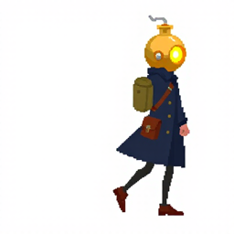 |

**Prompt**

```
16-bit pixel art video game sprite of one small original character: a courier whose head is an oversized round bright golden brass oil lamp with a glowing warm yellow glass lens and a small spout on top, wearing a long dark navy coat, thin dark legs and a small brown leather satchel on the hip. Side view facing right, triumphant, one fist punched high into the air, feet planted wide. Full body, one single character centered, plain flat white background, crisp hard-edged square pixels, flat 2D colours, limited palette of warm yellow, cream, navy, brown and near-black, 1-pixel dark outline, no 3D rendering, no shading, no gradients, no anti-aliasing, no text, no letters, no watermark
```

**Negative prompt**

```
N/A — FLUX.1-schnell is guidance-distilled; mflux accepts no negative prompt for it. Exclusions (3D shading, gradients, text, background) are written into the positive prompt.
```

## ART-PK-01

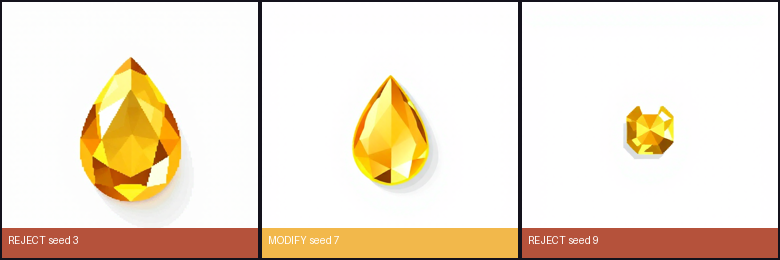

### ART-PK-01-20260930T011339Z-s3

| Field | Value |
|---|---|
| Created (UTC) | 2026-09-30T01:14:36+00:00 |
| Model / version | black-forest-labs/FLUX.1-schnell / mflux 0.20.0 (Python API); 4-bit copy saved locally with mflux-save from FLUX.1-schnell @ 741f7c3 |
| Runtime | local — arm64 macOS 26.6.2 (Apple M4 Pro, 16 GB) |
| Licence / terms | Apache-2.0 (FLUX.1-schnell weights); outputs usable without restriction |
| Settings | `{"seed": 3, "width": 512, "height": 512, "steps": 4, "quantize": 4, "seconds": 56.4, "peak_gb": 12.75}` |
| Storyboard panels | P3 |
| Decision | **reject** by Bao Xing at 2026-09-30T01:33:39+00:00 |
| Reason | Plain drop, no highlight left at 12 px. |
| Manual edits | — |
| Project files | — |
| Thumbnail |  |

**Prompt**

```
a single small faceted golden oil drop gem with a cream highlight, seen from above, 16-bit pixel art video game sprite, plain flat white background, crisp hard-edged square pixels, flat 2D colours, 1-pixel dark outline, no 3D rendering, no shading, no gradients, no anti-aliasing, no text, no letters, no watermark
```

**Negative prompt**

```
N/A — FLUX.1-schnell is guidance-distilled; mflux accepts no negative prompt for it. Exclusions (3D shading, gradients, text) are written into the positive prompt.
```

### ART-PK-01-20260930T011436Z-s7

| Field | Value |
|---|---|
| Created (UTC) | 2026-09-30T01:15:23+00:00 |
| Model / version | black-forest-labs/FLUX.1-schnell / mflux 0.20.0 (Python API); 4-bit copy saved locally with mflux-save from FLUX.1-schnell @ 741f7c3 |
| Runtime | local — arm64 macOS 26.6.2 (Apple M4 Pro, 16 GB) |
| Licence / terms | Apache-2.0 (FLUX.1-schnell weights); outputs usable without restriction |
| Settings | `{"seed": 7, "width": 512, "height": 512, "steps": 4, "quantize": 4, "seconds": 47.3, "peak_gb": 12.75}` |
| Storyboard panels | P3 |
| Decision | **modify** by Bao Xing at 2026-09-30T01:33:52+00:00 |
| Reason | Oil-drop gem whose cream highlight survives at 12 px. |
| Manual edits | keyed white bg + grey shadow; reduced 4x-supersampled; locked to the palette in Lab space (character); 1-px outline |
| Project files | godot/assets/art/pickup_gem.png |
| Thumbnail |  |

**Processing (every edit, in order)**

1. `{"utc": "2026-09-30T01:34:03+00:00", "tool": "gen/art_process.py", "mapping": "gen/mappings/ART-PK-01.json", "frame": "f0", "out": "godot/assets/art/pickup_gem.png", "index": 0, "mirror": false, "recolor": null, "trim_shadow": false, "post_squash_y": null, "box": null, "lamp_px": null, "frame_px": [12, 12], "palette": "character", "supersample": 4, "outline": true}`

**Prompt**

```
a single small faceted golden oil drop gem with a cream highlight, seen from above, 16-bit pixel art video game sprite, plain flat white background, crisp hard-edged square pixels, flat 2D colours, 1-pixel dark outline, no 3D rendering, no shading, no gradients, no anti-aliasing, no text, no letters, no watermark
```

**Negative prompt**

```
N/A — FLUX.1-schnell is guidance-distilled; mflux accepts no negative prompt for it. Exclusions (3D shading, gradients, text) are written into the positive prompt.
```

### ART-PK-01-20260930T011523Z-s9

| Field | Value |
|---|---|
| Created (UTC) | 2026-09-30T01:16:09+00:00 |
| Model / version | black-forest-labs/FLUX.1-schnell / mflux 0.20.0 (Python API); 4-bit copy saved locally with mflux-save from FLUX.1-schnell @ 741f7c3 |
| Runtime | local — arm64 macOS 26.6.2 (Apple M4 Pro, 16 GB) |
| Licence / terms | Apache-2.0 (FLUX.1-schnell weights); outputs usable without restriction |
| Settings | `{"seed": 9, "width": 512, "height": 512, "steps": 4, "quantize": 4, "seconds": 46.1, "peak_gb": 12.75}` |
| Storyboard panels | P3 |
| Decision | **reject** by Bao Xing at 2026-09-30T01:33:39+00:00 |
| Reason | Irregular blob at 12 px. |
| Manual edits | — |
| Project files | — |
| Thumbnail | 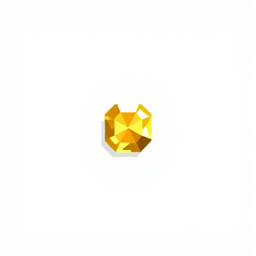 |

**Prompt**

```
a single small faceted golden oil drop gem with a cream highlight, seen from above, 16-bit pixel art video game sprite, plain flat white background, crisp hard-edged square pixels, flat 2D colours, 1-pixel dark outline, no 3D rendering, no shading, no gradients, no anti-aliasing, no text, no letters, no watermark
```

**Negative prompt**

```
N/A — FLUX.1-schnell is guidance-distilled; mflux accepts no negative prompt for it. Exclusions (3D shading, gradients, text) are written into the positive prompt.
```

## MUS-01

### MUS-01-20260930T013739Z-s5

| Field | Value |
|---|---|
| Created (UTC) | 2026-09-30T01:39:14+00:00 |
| Model / version | facebook/musicgen-medium / snapshot d3bd7b00761b78ad7a8a05145ee31e7832e9916c, transformers 5.17.0 |
| Runtime | local — arm64 macOS 26.6.2 (Apple M4 Pro, 16 GB) |
| Licence / terms | MusicGen weights CC-BY-NC-4.0 (non-commercial coursework use); AudioCraft code MIT |
| Settings | `{"seed": 5, "duration_s": 30, "max_new_tokens": 1500, "guidance_scale": 3.0, "sample_rate": 32000, "device": "mps", "dtype": "float16", "condition_on": null, "seconds": 94.9}` |
| Storyboard panels | P2, P3, P4, P5, P7, P8 |
| Decision | **modify** by Bao Xing at 2026-09-30T01:48:34+00:00 |
| Reason | Bao, after listening to all four loops three times: picked the first one; the rest were too chaotic ("第一个 剩下的太乱了 后面的杂音太多"). Measured: steadiest tempo (beat-interval CV 0.009), even loudness (RMS CV 0.17), no fade-out ending, warmest timbre (centroid 359 Hz, 0.8% energy above 6 kHz), smallest seam jump. |
| Manual edits | 8-bar loop cut on detected beats after a 1 s skip (95.7 BPM, 20.0 s); 0.25 s equal-power crossfade of the tail into the head; normalised to -3 dBFS peak; OGG Vorbis; loop flag set in Godot |
| Project files | godot/assets/music/mus_01_night_market.ogg |
| Thumbnail | 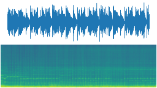 |

**Processing (every edit, in order)**

1. `{"utc": "2026-09-30T01:48:35+00:00", "tool": "gen/music_loop.py", "src": "accepted/MUS-01/MUS-01-20260930T013739Z-s5.wav", "dst": "../godot/assets/music/mus_01_night_market.ogg", "bpm": 95.703125, "bars": 8, "skip_s": 1.0, "start_sample": 57856, "loop_frames": 882176, "seconds": 20.004, "xfade_s": 0.25, "match_frames": null}`

**Prompt**

```
instrumental loop for a cozy but tense night market video game, 96 bpm, steady soft hand percussion, plucked kalimba and warm glassy mallets, low upright bass, mysterious minor key, even dynamics from start to end, no intro, no ending, no vocals
```

**Negative prompt**

```
N/A — MusicGen has no negative prompt; exclusions (vocals, intro, ending) are in the positive prompt.
```

### MUS-01-20260930T013914Z-s8

| Field | Value |
|---|---|
| Created (UTC) | 2026-09-30T01:40:49+00:00 |
| Model / version | facebook/musicgen-medium / snapshot d3bd7b00761b78ad7a8a05145ee31e7832e9916c, transformers 5.17.0 |
| Runtime | local — arm64 macOS 26.6.2 (Apple M4 Pro, 16 GB) |
| Licence / terms | MusicGen weights CC-BY-NC-4.0 (non-commercial coursework use); AudioCraft code MIT |
| Settings | `{"seed": 8, "duration_s": 30, "max_new_tokens": 1500, "guidance_scale": 3.0, "sample_rate": 32000, "device": "mps", "dtype": "float16", "condition_on": null, "seconds": 95.1}` |
| Storyboard panels | P2, P3, P4, P5, P7, P8 |
| Decision | **reject** by Bao Xing at 2026-09-30T01:48:34+00:00 |
| Reason | Bao: too chaotic / too much noise ("太乱了，杂音太多"). Measured: uneven loudness (RMS CV 0.41) and a fade-out ending (last 1 s at 34% of the mean). |
| Manual edits | — |
| Project files | — |
| Thumbnail | 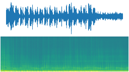 |

**Prompt**

```
instrumental loop for a cozy but tense night market video game, 96 bpm, steady soft hand percussion, plucked kalimba and warm glassy mallets, low upright bass, mysterious minor key, even dynamics from start to end, no intro, no ending, no vocals
```

**Negative prompt**

```
N/A — MusicGen has no negative prompt; exclusions (vocals, intro, ending) are in the positive prompt.
```

### MUS-01-20260930T014049Z-s13

| Field | Value |
|---|---|
| Created (UTC) | 2026-09-30T01:42:25+00:00 |
| Model / version | facebook/musicgen-medium / snapshot d3bd7b00761b78ad7a8a05145ee31e7832e9916c, transformers 5.17.0 |
| Runtime | local — arm64 macOS 26.6.2 (Apple M4 Pro, 16 GB) |
| Licence / terms | MusicGen weights CC-BY-NC-4.0 (non-commercial coursework use); AudioCraft code MIT |
| Settings | `{"seed": 13, "duration_s": 30, "max_new_tokens": 1500, "guidance_scale": 3.0, "sample_rate": 32000, "device": "mps", "dtype": "float16", "condition_on": null, "seconds": 95.3}` |
| Storyboard panels | P2, P3, P4, P5, P7, P8 |
| Decision | **reject** by Bao Xing at 2026-09-30T01:48:34+00:00 |
| Reason | Bao: too chaotic / too much noise ("太乱了，杂音太多"). Measured: brightest candidate (centroid 859 Hz, 6.6% energy above 6 kHz - 8x s5) and a fade-out ending. |
| Manual edits | — |
| Project files | — |
| Thumbnail | 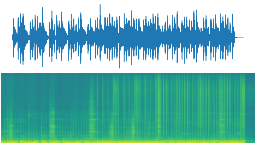 |

**Prompt**

```
instrumental loop for a cozy but tense night market video game, 96 bpm, steady soft hand percussion, plucked kalimba and warm glassy mallets, low upright bass, mysterious minor key, even dynamics from start to end, no intro, no ending, no vocals
```

**Negative prompt**

```
N/A — MusicGen has no negative prompt; exclusions (vocals, intro, ending) are in the positive prompt.
```

### MUS-01-20260930T014225Z-s21

| Field | Value |
|---|---|
| Created (UTC) | 2026-09-30T01:44:00+00:00 |
| Model / version | facebook/musicgen-medium / snapshot d3bd7b00761b78ad7a8a05145ee31e7832e9916c, transformers 5.17.0 |
| Runtime | local — arm64 macOS 26.6.2 (Apple M4 Pro, 16 GB) |
| Licence / terms | MusicGen weights CC-BY-NC-4.0 (non-commercial coursework use); AudioCraft code MIT |
| Settings | `{"seed": 21, "duration_s": 30, "max_new_tokens": 1500, "guidance_scale": 3.0, "sample_rate": 32000, "device": "mps", "dtype": "float16", "condition_on": null, "seconds": 95.0}` |
| Storyboard panels | P2, P3, P4, P5, P7, P8 |
| Decision | **reject** by Bao Xing at 2026-09-30T01:48:34+00:00 |
| Reason | Bao: too chaotic / too much noise ("太乱了，杂音太多"). Measured: gets quieter towards the end (69% of the mean) and the beat tracker locked onto double time (191 BPM). |
| Manual edits | — |
| Project files | — |
| Thumbnail | 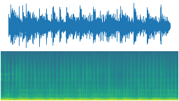 |

**Prompt**

```
instrumental loop for a cozy but tense night market video game, 96 bpm, steady soft hand percussion, plucked kalimba and warm glassy mallets, low upright bass, mysterious minor key, even dynamics from start to end, no intro, no ending, no vocals
```

**Negative prompt**

```
N/A — MusicGen has no negative prompt; exclusions (vocals, intro, ending) are in the positive prompt.
```

## MUS-02

### MUS-02-20260930T015010Z-s5

| Field | Value |
|---|---|
| Created (UTC) | 2026-09-30T01:51:34+00:00 |
| Model / version | facebook/musicgen-melody / snapshot 68d653a95788ec0d2b0abccab22c0b3a200c2d90, transformers 5.17.0 |
| Runtime | local — arm64 macOS 26.6.2 (Apple M4 Pro, 16 GB) |
| Licence / terms | MusicGen weights CC-BY-NC-4.0 (non-commercial coursework use); AudioCraft code MIT |
| Settings | `{"seed": 5, "duration_s": 30, "max_new_tokens": 1500, "guidance_scale": 3.0, "sample_rate": 32000, "device": "mps", "dtype": "float16", "condition_on": "godot/assets/music/mus_01_night_market.ogg", "seconds": 83.6}` |
| Storyboard panels | P6 |
| Decision | **reject** by Claude (automated layer check: tempo fit / high-frequency energy) - not listened to by Bao at 2026-09-30T01:56:59+00:00 |
| Reason | Wrong tempo for a layer: musicgen-melody with a drum-less prompt came out near 106 BPM; fitting 8 bars into the 20 s MUS-01 loop needs a stretch outside 0.9-1.1 (measured by gen/music_loop.py), so it would drift against MUS-01. |
| Manual edits | — |
| Project files | — |
| Thumbnail | 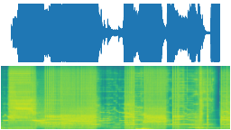 |

**Prompt**

```
gentle brighter layer to play on top of a calm night market loop, 96 bpm, warm glass bells and a soft sustained pad, simple and sparse, not busy, clean, no noise, no drums, same key, even dynamics from start to end, no intro, no ending, no vocals
```

**Negative prompt**

```
N/A — MusicGen has no negative prompt; exclusions (vocals, intro, ending) are in the positive prompt.
```

### MUS-02-20260930T015134Z-s8

| Field | Value |
|---|---|
| Created (UTC) | 2026-09-30T01:52:56+00:00 |
| Model / version | facebook/musicgen-melody / snapshot 68d653a95788ec0d2b0abccab22c0b3a200c2d90, transformers 5.17.0 |
| Runtime | local — arm64 macOS 26.6.2 (Apple M4 Pro, 16 GB) |
| Licence / terms | MusicGen weights CC-BY-NC-4.0 (non-commercial coursework use); AudioCraft code MIT |
| Settings | `{"seed": 8, "duration_s": 30, "max_new_tokens": 1500, "guidance_scale": 3.0, "sample_rate": 32000, "device": "mps", "dtype": "float16", "condition_on": "godot/assets/music/mus_01_night_market.ogg", "seconds": 81.8}` |
| Storyboard panels | P6 |
| Decision | **reject** by Claude (automated layer check: tempo fit / high-frequency energy) - not listened to by Bao at 2026-09-30T01:56:59+00:00 |
| Reason | In tempo (101 BPM, stretch 0.94) but 46% of its energy is above 6 kHz (centroid 5959 Hz vs 337 Hz for MUS-01): hiss, the 'noise' Bao rejected in MUS-01. |
| Manual edits | — |
| Project files | — |
| Thumbnail | 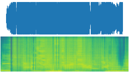 |

**Prompt**

```
gentle brighter layer to play on top of a calm night market loop, 96 bpm, warm glass bells and a soft sustained pad, simple and sparse, not busy, clean, no noise, no drums, same key, even dynamics from start to end, no intro, no ending, no vocals
```

**Negative prompt**

```
N/A — MusicGen has no negative prompt; exclusions (vocals, intro, ending) are in the positive prompt.
```

### MUS-02-20260930T015256Z-s13

| Field | Value |
|---|---|
| Created (UTC) | 2026-09-30T01:54:13+00:00 |
| Model / version | facebook/musicgen-melody / snapshot 68d653a95788ec0d2b0abccab22c0b3a200c2d90, transformers 5.17.0 |
| Runtime | local — arm64 macOS 26.6.2 (Apple M4 Pro, 16 GB) |
| Licence / terms | MusicGen weights CC-BY-NC-4.0 (non-commercial coursework use); AudioCraft code MIT |
| Settings | `{"seed": 13, "duration_s": 30, "max_new_tokens": 1500, "guidance_scale": 3.0, "sample_rate": 32000, "device": "mps", "dtype": "float16", "condition_on": "godot/assets/music/mus_01_night_market.ogg", "seconds": 77.1}` |
| Storyboard panels | P6 |
| Decision | **reject** by Claude (automated layer check: tempo fit / high-frequency energy) - not listened to by Bao at 2026-09-30T01:56:59+00:00 |
| Reason | Wrong tempo for a layer: musicgen-melody with a drum-less prompt came out near 106 BPM; fitting 8 bars into the 20 s MUS-01 loop needs a stretch outside 0.9-1.1 (measured by gen/music_loop.py), so it would drift against MUS-01. |
| Manual edits | — |
| Project files | — |
| Thumbnail | 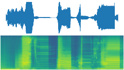 |

**Prompt**

```
gentle brighter layer to play on top of a calm night market loop, 96 bpm, warm glass bells and a soft sustained pad, simple and sparse, not busy, clean, no noise, no drums, same key, even dynamics from start to end, no intro, no ending, no vocals
```

**Negative prompt**

```
N/A — MusicGen has no negative prompt; exclusions (vocals, intro, ending) are in the positive prompt.
```

### MUS-02-20260930T015413Z-s21

| Field | Value |
|---|---|
| Created (UTC) | 2026-09-30T01:55:35+00:00 |
| Model / version | facebook/musicgen-melody / snapshot 68d653a95788ec0d2b0abccab22c0b3a200c2d90, transformers 5.17.0 |
| Runtime | local — arm64 macOS 26.6.2 (Apple M4 Pro, 16 GB) |
| Licence / terms | MusicGen weights CC-BY-NC-4.0 (non-commercial coursework use); AudioCraft code MIT |
| Settings | `{"seed": 21, "duration_s": 30, "max_new_tokens": 1500, "guidance_scale": 3.0, "sample_rate": 32000, "device": "mps", "dtype": "float16", "condition_on": "godot/assets/music/mus_01_night_market.ogg", "seconds": 81.9}` |
| Storyboard panels | P6 |
| Decision | **reject** by Claude (automated layer check: tempo fit / high-frequency energy) - not listened to by Bao at 2026-09-30T01:56:59+00:00 |
| Reason | Wrong tempo for a layer: musicgen-melody with a drum-less prompt came out near 106 BPM; fitting 8 bars into the 20 s MUS-01 loop needs a stretch outside 0.9-1.1 (measured by gen/music_loop.py), so it would drift against MUS-01. |
| Manual edits | — |
| Project files | — |
| Thumbnail | 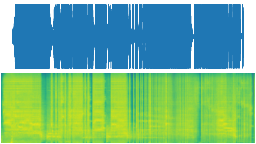 |

**Prompt**

```
gentle brighter layer to play on top of a calm night market loop, 96 bpm, warm glass bells and a soft sustained pad, simple and sparse, not busy, clean, no noise, no drums, same key, even dynamics from start to end, no intro, no ending, no vocals
```

**Negative prompt**

```
N/A — MusicGen has no negative prompt; exclusions (vocals, intro, ending) are in the positive prompt.
```

### MUS-02-20260930T015711Z-s34

| Field | Value |
|---|---|
| Created (UTC) | 2026-09-30T01:58:44+00:00 |
| Model / version | facebook/musicgen-medium / snapshot d3bd7b00761b78ad7a8a05145ee31e7832e9916c, transformers 5.17.0 |
| Runtime | local — arm64 macOS 26.6.2 (Apple M4 Pro, 16 GB) |
| Licence / terms | MusicGen weights CC-BY-NC-4.0 (non-commercial coursework use); AudioCraft code MIT |
| Settings | `{"seed": 34, "duration_s": 30, "max_new_tokens": 1500, "guidance_scale": 3.0, "sample_rate": 32000, "device": "mps", "dtype": "float16", "condition_on": null, "seconds": 92.5}` |
| Storyboard panels | P6 |
| Decision | **modify** by Bao Xing at 2026-09-30T02:34:59+00:00 |
| Reason | Bao, after listening to the three base+layer mixes (x3 loops): picked s34 because it has an ancient feel ("有种远古的感觉"). Measured: 97.5 BPM (stretch 0.99 to the MUS-01 loop), closest harmony to MUS-01 (chroma correlation 0.40), brighter than the base (centroid 769 Hz vs 337 Hz) with little hiss (2.6% above 6 kHz). |
| Manual edits | 8 bars cut on detected beats after a 1 s skip, time-stretched by 0.9897 to exactly MUS-01's 882176 frames; 0.25 s equal-power tail-into-head crossfade; normalised to -3 dBFS peak; OGG Vorbis; plays silently in sync with MUS-01 and fades in over 2 s on evolution |
| Project files | godot/assets/music/mus_02_sunflare_layer.ogg |
| Thumbnail | 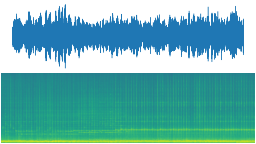 |

**Processing (every edit, in order)**

1. `{"utc": "2026-09-30T02:35:00+00:00", "tool": "gen/music_loop.py", "src": "accepted/MUS-02/MUS-02-20260930T015711Z-s34.wav", "dst": "../godot/assets/music/mus_02_sunflare_layer.ogg", "bpm": 97.50884433962264, "bars": 8, "skip_s": 1.0, "start_sample": 0, "loop_frames": 882176, "seconds": 20.004, "xfade_s": 0.25, "match_frames": "../godot/assets/music/mus_01_night_market.ogg", "stretch": 0.9897}`

**Prompt**

```
brighter layer for the same cozy night market video game loop, 96 bpm, soft plucked kalimba and warm glassy mallets playing a higher gentle counter-melody over a light sustained pad, clean, sparse, not busy, no noise, even dynamics from start to end, no intro, no ending, no vocals
```

**Negative prompt**

```
N/A — MusicGen has no negative prompt; exclusions (vocals, intro, ending) are in the positive prompt.
```

### MUS-02-20260930T015844Z-s55

| Field | Value |
|---|---|
| Created (UTC) | 2026-09-30T02:00:17+00:00 |
| Model / version | facebook/musicgen-medium / snapshot d3bd7b00761b78ad7a8a05145ee31e7832e9916c, transformers 5.17.0 |
| Runtime | local — arm64 macOS 26.6.2 (Apple M4 Pro, 16 GB) |
| Licence / terms | MusicGen weights CC-BY-NC-4.0 (non-commercial coursework use); AudioCraft code MIT |
| Settings | `{"seed": 55, "duration_s": 30, "max_new_tokens": 1500, "guidance_scale": 3.0, "sample_rate": 32000, "device": "mps", "dtype": "float16", "condition_on": null, "seconds": 93.3}` |
| Storyboard panels | P6 |
| Decision | **reject** by Bao Xing at 2026-09-30T02:34:59+00:00 |
| Reason | Bao listened to the base+layer mix and chose s34 instead ("1 因为有种远古的感觉"). Measured: best tempo fit (stretch 1.004) but weakest harmonic match to MUS-01 (chroma correlation 0.27). |
| Manual edits | — |
| Project files | — |
| Thumbnail | 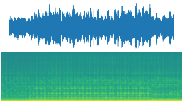 |

**Prompt**

```
brighter layer for the same cozy night market video game loop, 96 bpm, soft plucked kalimba and warm glassy mallets playing a higher gentle counter-melody over a light sustained pad, clean, sparse, not busy, no noise, even dynamics from start to end, no intro, no ending, no vocals
```

**Negative prompt**

```
N/A — MusicGen has no negative prompt; exclusions (vocals, intro, ending) are in the positive prompt.
```

### MUS-02-20260930T020017Z-s89

| Field | Value |
|---|---|
| Created (UTC) | 2026-09-30T02:01:52+00:00 |
| Model / version | facebook/musicgen-medium / snapshot d3bd7b00761b78ad7a8a05145ee31e7832e9916c, transformers 5.17.0 |
| Runtime | local — arm64 macOS 26.6.2 (Apple M4 Pro, 16 GB) |
| Licence / terms | MusicGen weights CC-BY-NC-4.0 (non-commercial coursework use); AudioCraft code MIT |
| Settings | `{"seed": 89, "duration_s": 30, "max_new_tokens": 1500, "guidance_scale": 3.0, "sample_rate": 32000, "device": "mps", "dtype": "float16", "condition_on": null, "seconds": 94.3}` |
| Storyboard panels | P6 |
| Decision | **reject** by Claude (automated layer check: tempo fit) - not listened to by Bao at 2026-09-30T02:04:06+00:00 |
| Reason | Wrong tempo for a layer: fitting 8 bars into the 20 s MUS-01 loop needs a 0.75 stretch (limit 0.9-1.1), so it would drift against MUS-01. |
| Manual edits | — |
| Project files | — |
| Thumbnail | 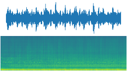 |

**Prompt**

```
brighter layer for the same cozy night market video game loop, 96 bpm, soft plucked kalimba and warm glassy mallets playing a higher gentle counter-melody over a light sustained pad, clean, sparse, not busy, no noise, even dynamics from start to end, no intro, no ending, no vocals
```

**Negative prompt**

```
N/A — MusicGen has no negative prompt; exclusions (vocals, intro, ending) are in the positive prompt.
```

### MUS-02-20260930T020152Z-s144

| Field | Value |
|---|---|
| Created (UTC) | 2026-09-30T02:03:28+00:00 |
| Model / version | facebook/musicgen-medium / snapshot d3bd7b00761b78ad7a8a05145ee31e7832e9916c, transformers 5.17.0 |
| Runtime | local — arm64 macOS 26.6.2 (Apple M4 Pro, 16 GB) |
| Licence / terms | MusicGen weights CC-BY-NC-4.0 (non-commercial coursework use); AudioCraft code MIT |
| Settings | `{"seed": 144, "duration_s": 30, "max_new_tokens": 1500, "guidance_scale": 3.0, "sample_rate": 32000, "device": "mps", "dtype": "float16", "condition_on": null, "seconds": 96.8}` |
| Storyboard panels | P6 |
| Decision | **reject** by Bao Xing at 2026-09-30T02:34:59+00:00 |
| Reason | Bao listened to the base+layer mix and chose s34 instead. Measured: noisiest in-tempo layer (14.9% energy above 6 kHz, centroid 2487 Hz) and uneven loudness (RMS CV 0.40). |
| Manual edits | — |
| Project files | — |
| Thumbnail | 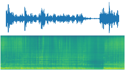 |

**Prompt**

```
brighter layer for the same cozy night market video game loop, 96 bpm, soft plucked kalimba and warm glassy mallets playing a higher gentle counter-melody over a light sustained pad, clean, sparse, not busy, no noise, even dynamics from start to end, no intro, no ending, no vocals
```

**Negative prompt**

```
N/A — MusicGen has no negative prompt; exclusions (vocals, intro, ending) are in the positive prompt.
```

