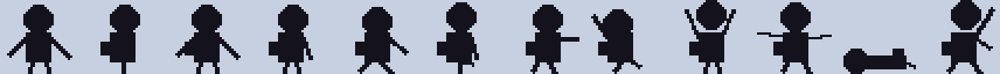
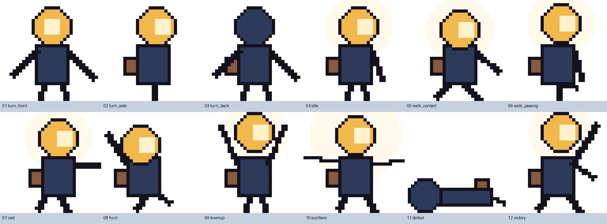
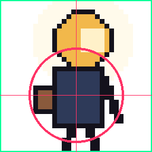

# Lanternfall — Character Sheet: the Lamp-Head Courier

`walker-lanternfall-bao-x` · Bao Xing · **v1 written 2026-09-28, before any generation**

All images on this page are **pre-generation blockouts** drawn by `design/character/make_blockout.py` at true game size (32 × 32) and enlarged with nearest-neighbour scaling. They are the target the generated sprites (asset ART-PC-01) must match; the comparison is added under **Revisions** after generation.

## 1. Identity

The courier from my Assignment 1 ([walker-jumpman-bao-x](https://github.com/yanxlh/walker-jumpman-bao-x)), moved from a side-view platformer to a top-down survivor. Carried over:

- an **oversized brass lamp housing** for a head, lens facing the direction of travel;
- a **narrow navy torso** (long coat);
- a **satchel counterweighting the trailing side**;
- the **light wedge / glow** that is now literally the weapon.

## 2. Silhouette test at game size

Actual size (1×) and the same strip at 3×:

Rule: **every gameplay pose must be identifiable in solid black at 32 px.** Order: turn_front, turn_side, turn_back, idle, walk_contact, walk_passing, cast, hurt, levelup, sunflare, defeat, victory.

| Riskiest pair | How they differ in silhouette |
|---|---|
| idle vs turn_side | idle: legs apart, front arm hanging; turn_side: legs together, no arm |
| walk_contact vs walk_passing | contact: legs in a wide V; passing: one leg lifted forward |
| levelup vs victory | levelup: both arms up in a V; victory: one fist up, other arm down, wide stance |
| levelup vs sunflare | levelup: arms up; sunflare: arms straight out sideways |
| turn_front vs turn_back | same outline **by design** (a turnaround); told apart by colour (gold lens vs navy back). Both are reference/title poses only, never used for a gameplay state. |

## 3. Facing

- Art is authored **facing right**. Facing left is a horizontal flip done by code (`draw_set_transform` with scale x = −1). The flip is a mirror, **not** counted as a pose.
- Facing follows **horizontal** input with a 0.1 dead-zone. Pure vertical input keeps the last facing, so the sprite never flickers when moving up/down or when a stick drifts.
- turn_front and turn_back exist for the sheet and the title/menu portrait only.

## 4. Poses and game states (12)

| # | Pose | Game state | Trigger | Duration |
|---|---|---|---|---|
| 1 | turn_front | reference / title menu portrait | MENU | while on menu |
| 2 | turn_side | reference | — | — |
| 3 | turn_back | reference | — | — |
| 4 | idle | PLAYING, not moving | no input | while still |
| 5 | walk_contact | PLAYING, moving | input held | alternates with 6 every 8 ticks |
| 6 | walk_passing | PLAYING, moving | input held | alternates with 5 every 8 ticks |
| 7 | cast | PLAYING | each Beam shot / each Sunflare pulse | 8 ticks / 12 ticks |
| 8 | hurt | PLAYING | damage taken | first 12 of the 48 invulnerable ticks |
| 9 | levelup | LEVELUP | level gained | while choosing a card (also the card-screen portrait) |
| 10 | sunflare | PLAYING | Sunflare card taken | 60 ticks, then idle/walk with brightened colours |
| 11 | defeat | LOST | HP reaches 0 | until retry (also the result-panel portrait) |
| 12 | victory | WON | timer reaches 3:00 | until retry (also the result-panel portrait) |

Priority when several apply: levelup/defeat/victory/sunflare override > hurt > cast > walk > idle.

## 5. Collision overlay

- Hurtbox: **circle, radius 10 px, centred at frame pixel (16, 20)** — the torso. In code the frame is drawn at `Rect2(-16, -20, 32, 32)`, so this pixel is the node's origin.
- The lamp top, the glow and the raised arms are **outside** the hurtbox on purpose (pillar "light is power": growing light never makes you easier to hit).
- F3 in game draws this circle over the live sprite.

## 6. Palette

| Hex | Role |
|---|---|
| `#F2B84B` | lamp gold — lamp housing, beam core |
| `#FFF1C9` | glow cream — lens, glow, highlights |
| `#2E3A59` | coat navy — torso, back of lamp |
| `#8A5A3C` | satchel brown |
| `#14121C` | outline ink — every outer edge, legs, arms |

## 7. Consistency rules (every frame)

1. 32 × 32 px, transparent background, **binary alpha** (0 or 255).
2. **Only the 5 palette colours** (checked by `gen/checks/palette_check.py`).
3. Feet touch **row 31** (except defeat).
4. Lamp diameter **11–13 px**.
5. Torso centre within **±1 px of (16, 20)**, except hurt (leans back) and defeat.
6. Satchel always on the **trailing side** (left, for the right-facing master).
7. **1-px ink outline** on every outer edge.
8. Lamp lens faces the travel direction (right) in every side pose.
9. Stored frames always face right; a left-facing generated cell may be mirrored once during processing only to restore this rule, and that edit is logged.

## Revisions

### R2 · 2026-09-29 · 10 poses, generated as 2D pixel art

Bao's direction after the first batch: 2D pixel art, not many actions. The sheet keeps the rubric minimum of **10 poses**; the two reference-only turnaround views that no game state uses (**turn_side**, **turn_back**) are dropped. New frame order in `pc_sheet.png` (320 × 32):

| # | Pose | Game state |
|---|---|---|
| 1 | turn_front | title menu portrait |
| 2 | idle | PLAYING, still |
| 3 | walk_contact | PLAYING, moving (alternates with 4 every 8 ticks) |
| 4 | walk_passing | PLAYING, moving |
| 5 | cast | 8 ticks after each Beam shot / 12 after each Sunflare pulse |
| 6 | hurt | first 12 of the 48 invulnerable ticks |
| 7 | levelup | LEVELUP |
| 8 | sunflare | 60 ticks after evolving |
| 9 | defeat | LOST |
| 10 | victory | WON |

Every other rule on this page is unchanged (palette, 32 × 32, binary alpha, feet on row 31, hurtbox r = 10 at (16, 20), right-facing master with code flip). The pre-generation blockout above still shows 12 poses; it is kept as the original record. Verified by `test_gameplay.gd::pose-table-matches-sheet` (10 poses, sheet width = 32 × 10).
