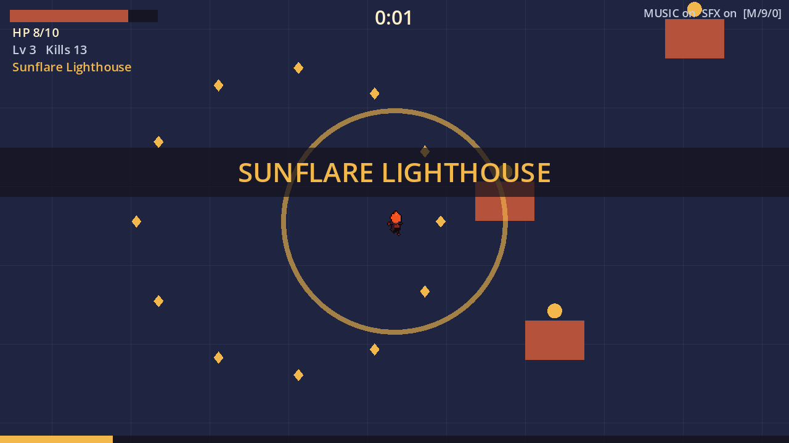

# walker-lanternfall-bao-x — Lanternfall

**CSYE 7270 · Assignment 2 — Generate Art, Sound, and Music for Your Game · Bao Xing**

A lamp-headed courier is trapped in a fog-bound midnight market, and the light on his shoulders is his only weapon. Keep moving, grow the light, and survive three minutes until the fog lifts.

This is an **asset slice**, not a finished game: a playable Godot scene that proves generated art, sound effects and music work together. It is a small survivors-like — you only move; the Beam and the Lamp-Moths fire on their own; enemies drop lamp-oil gems; level-ups offer branching cards; maxing both weapons unlocks the **Sunflare Lighthouse** evolution.



## Started from

A **blank Godot 4.7.2 project**. The protagonist concept is carried over from my Assignment 1, [yanxlh/walker-jumpman-bao-x](https://github.com/yanxlh/walker-jumpman-bao-x), itself an extension of [nikbearbrown/walker-jumpman](https://github.com/nikbearbrown/walker-jumpman). No files from either are included.

## Run it

- Engine: **Godot 4.7.2.stable.official.ed1daf0bf** (GL Compatibility). Tested on macOS 26, Apple M4 Pro.
- macOS: double-click [`walker-lanternfall.command`](walker-lanternfall.command) (expects Godot in `/Applications`). On the first run it imports the assets, then starts the game.
- Anywhere else: import once, then run — `godot --headless --path godot --import --quit` then `godot --path godot` — or open `godot/project.godot` in the Godot editor (which imports automatically). **Without the import step a fresh clone runs with placeholder shapes and no sound.** All assets are committed; nothing is downloaded at run time.

## Controls

| Action | Keyboard | Gamepad |
|---|---|---|
| Start | Enter / Space | A |
| Move | WASD / arrow keys | left stick |
| Pick a level-up card | 1 / 2 / 3, or ← → + Enter | d-pad + A |
| Pause / resume | Esc / P | Start |
| Restart | R | Y |
| **Mute everything / music only / effects only** | **M / 9 / 0** | — |
| Show the hurtbox | F3 | — |

The HUD always shows `MUSIC on/off  SFX on/off`. The game is fully playable muted: every sound has a visual (hit flash + knockback + HP bar, gem flight, paused card screen, evolution banner, result panel).

## What this slice proves

- **Design before generation.** CONCEPT, STORYBOARD, CHARACTER-SHEET and CHANGE-BRIEF were committed and tagged [`design-v1`](https://github.com/yanxlh/walker-lanternfall-bao-x/releases/tag/design-v1) (2026-09-28 15:21 EDT) before the first generation; `scripts/audit_repo.py --stage final` checks that every generation sidecar is newer than the tag. Later changes are appended as dated **Revisions**.
- **Generated art in the scene:** a 10-pose courier sheet, two 2-frame enemies, a seamless ground tile, a broken-up market of stalls, noodle carts, lantern posts, crates, puddles and leaves, three weapon effects and a pickup — 14 sprites from FLUX.1-schnell, run locally, reduced to game size and locked to two fixed palettes.
- **Sound tied to events, once per event:** 7 effects (Stable Audio Open) triggered only by game signals and throttled by a pure `SfxGate` (cooldowns, voice caps, once-per-run).
- **Seamless music:** a 20 s night-market loop plus a Sunflare layer of exactly the same length (MusicGen), cut on beats with a crossfaded seam; pause muffles and ducks it, level-up ducks it, lose/win fade it out while the stinger plays.
- **Sound never drives the game:** a full seeded run with every stream removed and the master bus muted ends in exactly the same state as a run with sound (`test_audio.gd::independence`).

## Checks

```bash
cd godot && godot --headless --path . --import --quit && for s in logic gameplay audio; do godot --headless --path . --script res://tests/test_$s.gd || break; done
```

| Check | What it proves | Evidence |
|---|---|---|
| `godot/tests/test_logic.gd` | state machine, upgrade cards and evolution, SFX gate rules | `evidence/logic.json` |
| `godot/tests/test_gameplay.gd` | movement, facing, poses, weapons, level-up queue, hurt i-frames, win/lose, restart, missing-art fallback, HUD text, hurtbox on the generated torso | `evidence/gameplay.json` |
| `godot/tests/test_audio.gd` | once-per-event SFX, bursts, held/rapid input, music duck/filter/fade, restart during fade, sound-independence | `evidence/audio.json` |
| `gen/checks/palette_check.py` | every sprite: exact size, binary alpha, palette only; enemy/ground contrast | `evidence/palette-check.json` |
| `gen/checks/loop_check.py` | music wrap point has no click or gap; layer length = base length | `evidence/loop-check.json` |
| `scripts/audit_repo.py --stage final` | no MP3/MP4/big files/caches/keys; every CHANGE-BRIEF asset exists; generation after `design-v1` | `evidence/repo-audit.json` |

Python checks run with the generation environment: `gen/.venv-audio/bin/python gen/checks/palette_check.py`, etc. (setup in `gen/requirements-*.txt`, Python 3.12 via uv).

## Read in this order

1. [CONCEPT.md](CONCEPT.md) — the game, pillars, art/audio/music direction, and revisions R1–R6 (aiming, pixel art, XP, map, HP growth and cards, solid props, broken-up map)
2. [STORYBOARD.md](STORYBOARD.md) — nine panels, and the storyboard-vs-game comparison
3. [CHARACTER-SHEET.md](CHARACTER-SHEET.md) — silhouettes, facing, poses, hurtbox, palette, and the sheet-vs-game comparison
4. [CHANGE-BRIEF.md](CHANGE-BRIEF.md) — asset list, event→sound map, music behaviour, predictions and how they turned out
5. [ASSET-LOG.md](ASSET-LOG.md) — every generation, accepted or rejected, with prompts, seeds and edits
6. [SOURCES.md](SOURCES.md) — models, exact revisions, licences, tools
7. [TEST-REPORT.md](TEST-REPORT.md) — automated checks and my two playtests
8. [FRICTIONAL.md](FRICTIONAL.md) — the daily diary of what I wanted, what came back, what I decided

## Known limitations

- The fog-wraith has the lowest measured contrast against the ground (0.03) and the courier is small (≈20 px on a 360 px screen); both were readable in my muted playtest, but they are the first things to revisit.
- Music loops are 20 s (MusicGen's 30 s limit), so a 3-minute run hears the loop 9 times.
- One map, two weapons, one evolution, no saving; balance is only roughly tuned (my playtests and scripted bots).
- Gamepad support exists but is untested; on the card screen the left stick can skip several cards.

## Film

**Lanternfall, Taken Apart** — a 4K landscape teardown made with the godot-gamedev skill + walker modifier (9 min 44 s).

| | |
|---|---|
| File | `claude-liam-walker-lanternfall-bao-x-gamedev.mp4` (3840 × 2160, 30 fps, H.264 + AAC, 322.6 MB) |
| Link | *course media space — added after upload* |
| SHA-256 | `585a89d4a1818588e659e20b69f835176d490790bf03f49efec30b5538ddc779` |
| Source revision shown | `8a6f9881e0e2858e523d22bb09f1a423695f04e1` (`godot/` is unchanged since) |

Beat sheet, script, prompts, evidence ledger, capture method and checks: [`youtube/claude-liam-walker-lanternfall-bao-x-gamedev/`](youtube/claude-liam-walker-lanternfall-bao-x-gamedev/README.md). The video file itself is not in git.
