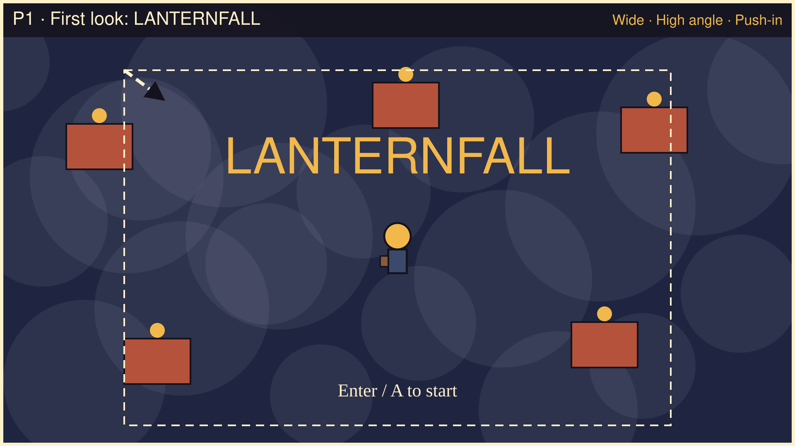
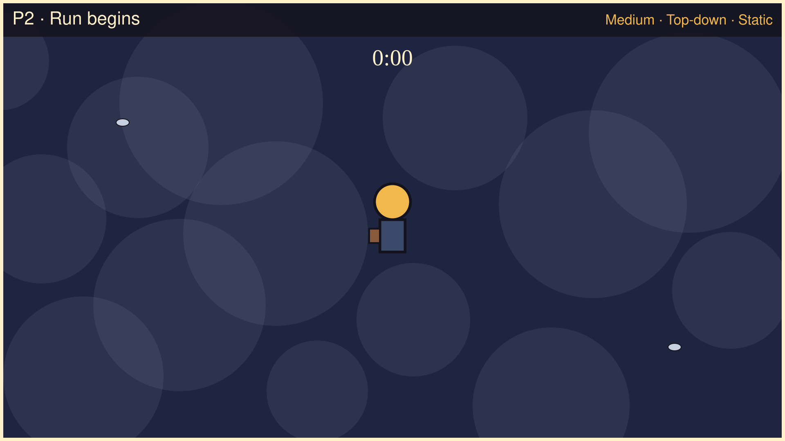
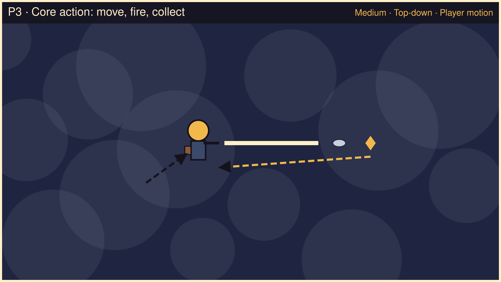
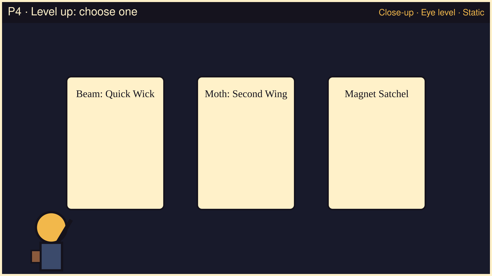
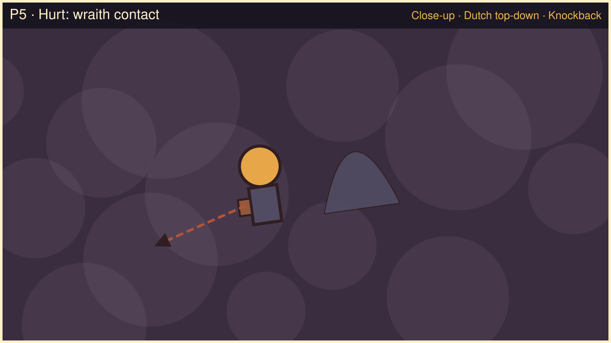
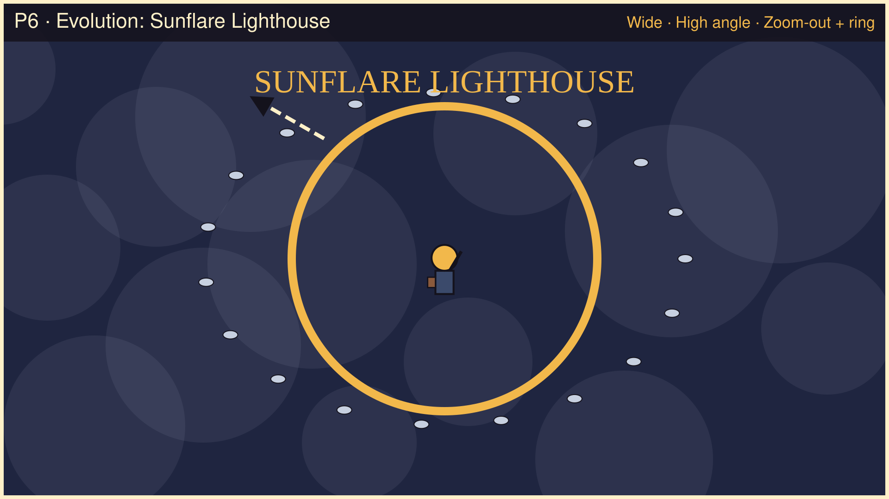
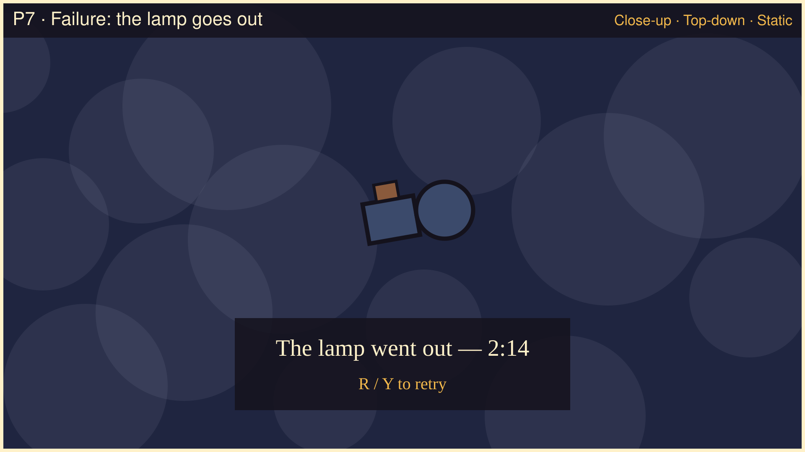
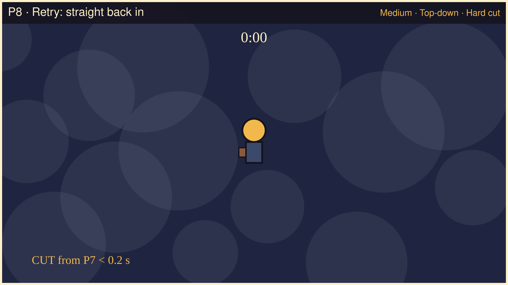
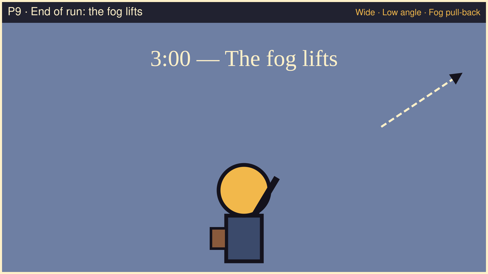

# Lanternfall — Storyboard

`walker-lanternfall-bao-x` · Bao Xing · **v1 written 2026-09-28, before any generation**

Nine 16:9 greybox panels (1920 × 1080 SVG) drawn by `design/storyboard/make_panels.py` from simple shapes only; no generated art. Hand-drawn replacements, if any, will be added under **Revisions**. Asset IDs refer to the list in [CHANGE-BRIEF.md](CHANGE-BRIEF.md).

| ID | Beat | Shot | Angle | Movement |
|---|---|---|---|---|
| P1 | First thing seen: title over the fogged market | Wide | High angle (3/4 overhead) | Slow push-in |
| P2 | Run starts, courier centred, music begins | Medium | Top-down (bird's-eye) | — |
| P3 | Core action: move, beam fires, moth dies, gem flies in | Medium | Top-down | Player motion + gem path |
| P4 | Level-up: 3 cards, cheering portrait | Close-up | Eye level (UI portrait) | — |
| P5 | Hurt: wraith contact, red flash, knockback | Close-up | Dutch (tilted) top-down | Knockback |
| P6 | Evolution: Sunflare burst clears the ring | Wide | High angle | Zoom-out + ring expansion |
| P7 | Failure: lamp goes out, defeat pose, result panel | Close-up | Top-down | — |
| P8 | Retry: R → straight back to P2 framing | Medium | Top-down | Hard cut |
| P9 | End of run: 3:00, fog lifts, victory portrait | Wide | Low angle (end-panel portrait) | Fog pull-back |

---

## P1 · First look: LANTERNFALL

- **Shot / angle / movement:** Wide · High angle · slow push-in from the dashed outer frame to the inner one over ~3 s
- **Player does:** nothing yet; reads the title; presses Enter / A
- **Screen shows:** the fogged market square with lantern stalls, the courier small in the middle, title, "Enter / A to start"
- **Sound:** silence (menu is silent by design)
- **Assets:** ART-ENV-01, ART-ENV-02, ART-PC-01 (turn_front)
- **Why:** the first frame sells the premise without text: one warm light in a cold place. Silence makes the first note of music on P2 an event.

## P2 · Run begins

- **Shot / angle / movement:** Medium · Top-down · static
- **Player does:** first movement input
- **Screen shows:** courier centred, timer 0:00, first two moths entering from off-screen
- **Sound:** MUS-01 starts from the top (MUS-02 running silently in sync)
- **Assets:** ART-PC-01 (idle, walk_contact, walk_passing), ART-EN-01, ART-ENV-01
- **Why:** the gameplay camera: centred player, enough room on every side to see what is coming.

## P3 · Core action: move, fire, collect

- **Shot / angle / movement:** Medium · Top-down · player motion arrow and dashed gem path
- **Player does:** holds a direction
- **Screen shows:** courier in cast pose, beam leaving along the movement direction, moth breaking, gem flying into the satchel
- **Sound:** SFX-01 on the kill (throttled), SFX-02 when the gem lands; MUS-01 underneath
- **Assets:** ART-PC-01 (cast, walk_contact, walk_passing), ART-EN-01, ART-FX-01, ART-PK-01, ART-ENV-01
- **Why:** proves the only verb (movement) produces every reward; the gem path shows the loop with no text.

## P4 · Level up: choose one

- **Shot / angle / movement:** Close-up · Eye level (UI portrait bottom-left) · static
- **Player does:** presses 1 / 2 / 3, or d-pad + A
- **Screen shows:** dimmed frozen field, three cards (e.g. Quick Wick / Lamp-Moths / Magnet Satchel), the courier cheering
- **Sound:** SFX-04 once per level gained; MUS-01 ducks by 6 dB
- **Assets:** ART-PC-01 (levelup), ART-FX-02 (icon on the moth card)
- **Why:** a success beat and the main decision point. Freezing the field removes time pressure from the choice.

## P5 · Hurt: wraith contact

- **Shot / angle / movement:** Close-up · Dutch (tilted) top-down · knockback arrow away from the wraith
- **Player does:** gets caught by a fog-wraith
- **Screen shows:** red screen tint, courier flashing red in the hurt pose, knocked away, HP bar dropping
- **Sound:** SFX-03 once per hit (hits are separated by 0.8 s of invulnerability)
- **Assets:** ART-PC-01 (hurt), ART-EN-02
- **Why:** harm must be unmistakable even muted: colour, pose, motion and the bar all change together. The tilt is the storyboard's way of saying "something went wrong"; in game this is the tint + knockback.

## P6 · Evolution: Sunflare Lighthouse

- **Shot / angle / movement:** Wide · High angle · zoom-out while the gold ring expands outward
- **Player does:** takes the Sunflare card after maxing Beam and Moths
- **Screen shows:** "SUNFLARE LIGHTHOUSE" banner, courier in the power pose, a ring of light erasing the moths around him
- **Sound:** SFX-05 once per run; MUS-02 fades in over 2 s
- **Assets:** ART-PC-01 (sunflare), ART-FX-03, ART-EN-01
- **Why:** the big success moment and the payoff of pillar 1 (light is power); wide framing shows how much of the crowd one burst clears.

## P7 · Failure: the lamp goes out

- **Shot / angle / movement:** Close-up · Top-down · static
- **Player does:** loses the last HP
- **Screen shows:** courier collapsed with a dark lamp, result panel "The lamp went out — m:ss", "R / Y to retry"
- **Sound:** music fades out over 0.5 s, SFX-06a once
- **Assets:** ART-PC-01 (defeat)
- **Why:** failure is quiet and clear, and the retry prompt is on screen at the moment frustration peaks.

## P8 · Retry: straight back in

- **Shot / angle / movement:** Medium · Top-down · hard cut from P7 in under 0.2 s
- **Player does:** presses R / Y
- **Screen shows:** the P2 composition again, timer 0:00
- **Sound:** MUS-01 restarts from the top at full volume, no filter
- **Assets:** ART-PC-01 (idle), ART-ENV-01
- **Why:** pillar 4 — the cost of losing is one key press. Reusing P2's framing tells the player nothing carried over.

## P9 · End of run: the fog lifts

- **Shot / angle / movement:** Wide · Low angle (portrait on the end panel, looking up at the courier) · fog pulls back
- **Player does:** survives to 3:00
- **Screen shows:** lighter screen, large victory portrait, "3:00 — The fog lifts", kills and level, "R / Y to play again"
- **Sound:** music fades over 1 s, SFX-06b once
- **Assets:** ART-PC-01 (victory)
- **Why:** the end of a run; the low angle makes the small courier heroic for the first time.

---

## Coverage

| Requirement | Panels |
|---|---|
| First thing the player sees | P1 |
| Core action | P3 |
| Success | P4, P6 |
| Failure | P5 (hurt), P7 (lose) |
| Recovery / retry | P8 |
| End of a run | P9 |
| Shot sizes (≥ 3) | Wide P1 P6 P9 · Medium P2 P3 P8 · Close-up P4 P5 P7 |
| Camera angles (≥ 3) | High P1 P6 · Top-down P2 P3 P7 P8 · Eye level P4 · Dutch P5 · Low P9 |
| Movement / camera motion (≥ 2) | P1 push-in · P3 player + gem motion · P5 knockback · P6 zoom-out · P9 pull-back |
| Aspect | all 16:9 |

## Revisions

### R1 · 2026-09-29 · Storyboard vs the running game

Left: the design-v1 panel (rasterised with Godot's SVG loader, which drops the panels' text labels). Right: the same moment captured from the game by `godot/tests/capture.gd` with the generated assets.

| Panel | Matches | Differs, and why |
|---|---|---|
| P1 first look | title, "Enter / A to start", market stalls, courier portrait | static camera: the slow **push-in is not implemented**; stalls and courier are much smaller than drawn |
| P2 run begins | centred courier, 0:00, HUD | the courier is ~20 px tall on a 360 px screen — far smaller than the panel suggests |
| P3 core action | beam fires at the nearest enemy (CONCEPT R1), moth breaks, gem flies in | the beam aims at enemies, not along the arrow of travel as drawn |
| P4 level up | dimmed field, three cards, cheering portrait bottom-left | — |
| P5 hurt | red tint, knockback, HP bar | **no Dutch tilt** (the camera never rotates); the fog-wraith is nearly invisible on the cobbles (contrast 0.03 — CHANGE-BRIEF prediction 4) |
| P6 evolution | banner, sunburst, enemies cleared into gems | **no zoom-out** |
| P7 failure | defeat pose with the lamp out, result panel, "R / Y to retry" | — |
| P8 retry | back to the P2 framing at 0:00 | — |
| P9 end of run | "3:00 — The fog lifts", victory portrait, kills/level | the screen does **not** lighten ("fog pull-back" not implemented) |

Camera moves were storyboard intentions for mood; the slice implements none of them. They are listed as known limitations and next steps rather than faked in the capture.

### R2 · 2026-09-29 · The storyboard's camera moves, added after R1

Bao asked for the camera moves R1 listed as missing. `godot/features/world/camera_fx.gd` implements them; the simulation never reads the camera, and `test_audio.gd::independence` still passes.

| Panel | Now in the game | Verified by |
|---|---|---|
| P1 | title opens at zoom 0.8 and pushes in to 1.0 over 3 s | `test_gameplay.gd::camera-menu-push-in` |
| P5 | on each hit the camera tilts up to 0.07 rad (≈ 4°) and settles over the 12 hurt-pose ticks | `camera-hurt-tilt` |
| P6 | on Sunflare the camera zooms out to 0.72 over 20 ticks and back over 70 | `camera-sunflare-zoom-out` |
| P9 | at 3:00 the screen washes towards mist (up to 45 %) while the camera pulls back to 0.82 over 2 s | `fog-lifts-on-win` |

The comparison image above was re-captured with these moves (P1 wide, P5 tilted, P6 zoomed out, P9 lightened).

### R3 · 2026-10-02 · View and pillar for each panel

| Panel | View | Pillar the panel serves |
|---|---|---|
| P1 · First look | title screen, outside play | 1 · Light is power — one warm light in a cold place; silence before the first note |
| P2 · Run begins | gameplay camera | 2 · Feet, not fingers — room on every side to move |
| P3 · Core action | gameplay camera | 2 · Feet, not fingers — the only verb produces every reward |
| P4 · Level up | gameplay, card-screen UI with portrait | 2 · Feet, not fingers — the decision, without time pressure |
| P5 · Hurt | gameplay camera (the tilt is the hit feedback) | 3 · Readable in silence — harm unmistakable even muted |
| P6 · Evolution | gameplay camera, zoom-out | 1 · Light is power — the payoff |
| P7 · Failure | gameplay with the result panel | 4 · Three-minute runs — the retry prompt at once |
| P8 · Retry | gameplay camera | 4 · Three-minute runs — losing costs one key press |
| P9 · End of run | result-panel portrait, low angle (design view) | 1 and 4 — the fog lifts at 3:00 and the run ends |
