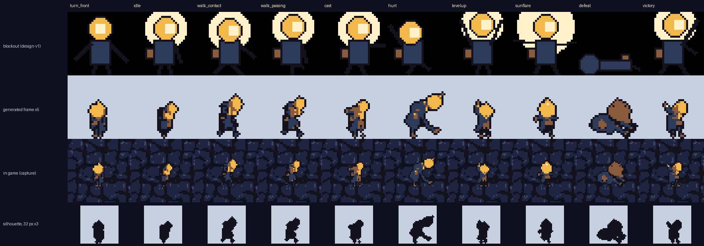
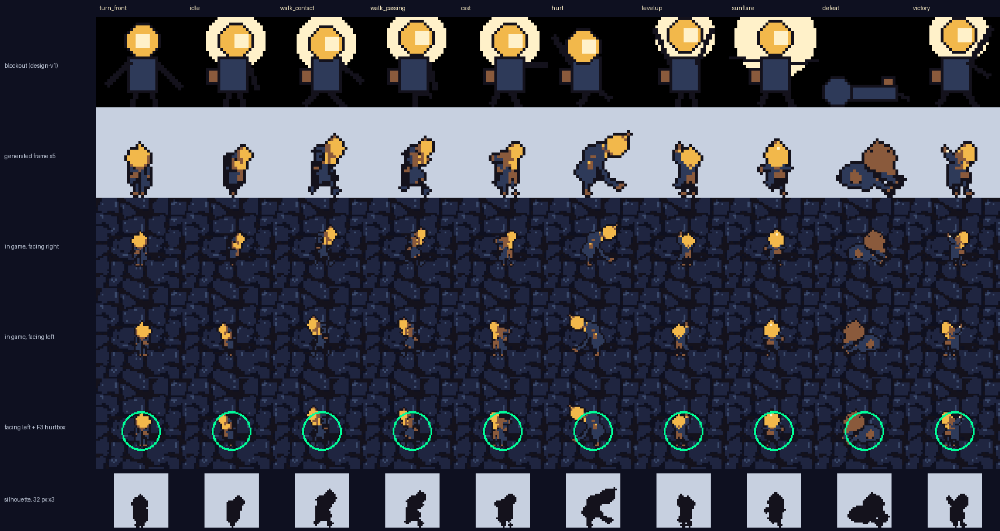
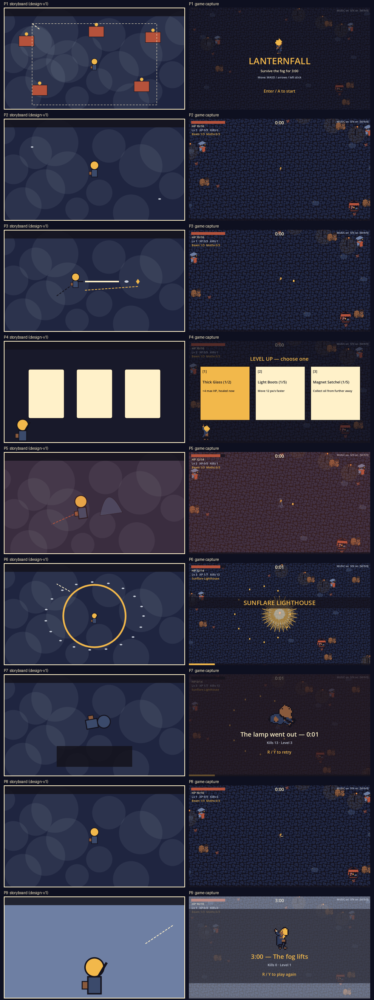

# TEST-REPORT

`walker-lanternfall-bao-x` · Bao Xing · CSYE 7270 Assignment 2

> **Status: 2026-10-02.** Source revision **`8a6f988`** (the revision the film shows; `godot/` is unchanged after it) for every automated check, capture and comparison below; engine **Godot 4.7.2.stable.official.ed1daf0bf**. My two full playtests (sound on, then muted) are in §4, with the build each was played on. The fresh clone from GitHub is done (§2). Nothing here is claimed before it was observed.

## 1. Environment

| | |
|---|---|
| Machine | MacBook, Apple M4 Pro, 16 GB, macOS 26 |
| Engine | Godot 4.7.2.stable.official.ed1daf0bf, GL Compatibility |
| Input | keyboard and gamepad bindings exist; my notes do not record a gamepad test |
| Generation / checks | Python 3.12 venvs from `gen/requirements-*.txt` |

## 2. Fresh copy

- **Local fresh clone of `1b24721`** (2026-10-01): `git clone` into an empty folder → `godot --headless --path godot --import` → all three suites: **logic 32/32, gameplay 63/63, audio 22/22**, no script errors; `audit_repo.py --stage final`: 0 problems. All 14 sprites, 7 sound effects and 2 music loops were present; nothing is downloaded at run time. (An earlier clone of `89ae6ed`, before the sounds and new props, also passed.)
- **Fresh clone from GitHub** (2026-10-02, commit `a600e65`; `godot/` identical to `8a6f988`): `git clone https://github.com/yanxlh/walker-lanternfall-bao-x.git` into an empty folder — a 63 MB checkout with no Godot cache, no file over 25 MB and no MP3/MP4 → `godot --headless --path godot --import --quit` (46 files imported, 0 errors) → **logic 32/32, gameplay 65/65 (including `generated-assets-load`), audio 25/25**, no script errors → `scripts/audit_repo.py --stage final`: 0 problems → all 23 asset files listed in `godot/assets/manifest.json` present → the game starts and runs (5 s launch, no errors in the log). Commits after `a600e65` change documents only.

## 3. Automated checks (all added for this project)

| Check | Result on `8a6f988` (re-run 2026-10-01/02) | What it proves | Evidence |
|---|---|---|---|
| `godot/tests/test_logic.gd` | 32 / 32 | state machine; branching cards, 5-level passives, damage/haste multipliers, evolution rule; XP needed always rises; SFX gate cooldowns, voice caps, once-per-run | `evidence/logic.json` |
| `godot/tests/test_gameplay.gd` | 65 / 65 | movement, diagonal normalisation, facing dead-zone, poses, nearest-enemy aim, bullets stop on visible contact, gems, level-up queue (incl. while paused), i-frames, win/lose incl. same-tick, evolution, restart, missing-art fallback, HUD text, hurtbox on the torso, HP growth, damage/haste cards, camera moves, map layout, solid props | `evidence/gameplay.json` |
| `godot/tests/test_audio.gd` | 25 / 25 (with the real sounds loaded) | once-per-event SFX, bursts, held/rapid input, music duck/filter/fade, restart during fade, mute, **sound-independence** | `evidence/audio.json` |
| `gen/checks/palette_check.py` | 14 / 14 sprites PASS | exact size, binary alpha, palette-only; enemy-vs-ground contrast | `evidence/palette-check.json` |
| `gen/checks/loop_check.py` | MUS-01, MUS-02 PASS; layer length PASS | loop wrap has no click or gap; layer = base length | `evidence/loop-check.json` |
| `gen/tile_process.py` seam metric | PASS (seam 7.52 vs interior 6.05) | the ground tile tiles without a visible seam | `evidence/tile-seam.json` |
| `scripts/audit_repo.py --stage final` | 0 problems (all 23 asset IDs present); order check PASS | no MP3/MP4/large files/caches/keys; every CHANGE-BRIEF asset exists; **every generation is newer than `design-v1`** (tag 2026-09-28 15:21 EDT; first generation commit `e384933`, 2026-09-29 16:57 EDT, a descendant of the tag) | `evidence/repo-audit.json` |
| balance probe `godot/tests/probe_balance.gd` | informational | scripted bots to compare tuning | `evidence/balance-probe-*.txt` |

The test harness fails a suite that stops early; my runner also fails on any `SCRIPT ERROR` (both added after a script error once aborted a helper silently).

Commands (from the repository root; Python checks use the venvs from `gen/requirements-*.txt`):

```
godot --headless --path godot --import --quit
godot --headless --path godot --script res://tests/test_logic.gd       # -> logic: 32 checks, 0 failures
godot --headless --path godot --script res://tests/test_gameplay.gd    # -> gameplay: 65 checks, 0 failures
godot --headless --path godot --script res://tests/test_audio.gd       # -> audio: 25 checks, 0 failures
gen/.venv-art/bin/python gen/checks/palette_check.py
gen/.venv-audio/bin/python gen/checks/loop_check.py godot/assets/music/mus_01_night_market.ogg godot/assets/music/mus_02_sunflare_layer.ogg
python3 scripts/audit_repo.py --stage final
```

The suites' full output on a fresh `git archive 8a6f988` copy is kept in `youtube/claude-liam-walker-lanternfall-bao-x-gamedev/capture/test-run-film-build-raw.txt` (122 PASS, 0 FAIL, no script errors).

## 4. My playtests

Full notes in my words: [`evidence/playtest/2026-09-29-bao-notes.md`](evidence/playtest/2026-09-29-bao-notes.md). Checklist for the final runs: [`evidence/playtest/sheet.md`](evidence/playtest/sheet.md).

| Session | Build | What I checked | Outcome |
|---|---|---|---|
| 1 — 2026-09-29, music only, no SFX yet | `40102ab` | first play of the greybox with generated art | bullets flew through monsters → loop L1 below; asked for a fuller map, rising XP cost, tougher monsters over time, more cards |
| 2 — 2026-09-29/30, music only | `79c2874` | re-test after the fixes | "子弹对的" (bullets fixed), "撞墙手感还行" (collisions feel fine), "不难" (not hard), "有合成出来" (I reached the Sunflare); asked for a more broken-up map |
| **Run A — sound on** — 2026-10-01 | `1b24721` | the full sound checklist | "只响一次，不会连起来，不会，没有空白" — each sound once, kills never machine-gun, no extra sounds from tapping/holding, no gap at the loop; pause, level-up duck, Sunflare layer, lose/win fade + stinger, R during the fade, M/9/0 all confirmed — [`evidence/playtest/2026-10-01-runs-A-B.md`](evidence/playtest/2026-10-01-runs-A-B.md) |
| **Run B — muted (M on the title screen)** — 2026-10-01 | `1b24721` | can I read every event without sound? | "第二局都能" — hits, level-ups and the evolution all readable from the picture; wraiths and the courier visible |

## 5. Movement and state changes

- Automated: `move-speed` (90 px/s), `diagonal-normalized`, `facing-left`, `facing-deadzone` (no flip for |x| ≤ 0.1), `arena-clamp`, `walk-pose` / `idle-pose` / `cast-pose-on-fire`, `levelup-opens` / `choose-card`, `levelup-queue`, `levelup-while-paused`, `death-lost`, `won-at-3min`, `death-and-timer-same-tick`, `restart-resets`, `props-block-the-courier`, `courier-slides-along-props` — all PASS.
- In play (sessions 1–2), confirmed in my notes: bullets now stop on hit, blocking props feel fine, and I reached the Sunflare evolution. Other states were not called out in the notes; Run A/B use the full checklist.

## 6. Character vs character sheet



Blockout (design-v1) · generated frame · the frame captured in the running game · generated silhouette.

**Both facings and the hurtbox, in the engine (added 2026-10-02):**



Rows: blockout · generated frame · in game facing right · in game facing left · facing left with the F3 hurtbox (r = 10 at sprite origin (16, 23)). Captured on an isolated copy of `8a6f988` by `scripts/capture_facing.gd` (same seed and setup as `godot/tests/capture.gd`; screens `evidence/screens/pose-*-left*.png`). Facing left is the code's mirror of the right-facing frame for every pose, as the sheet specifies. Mismatches with the collision shape, pose by pose: in the standing poses (turn_front, idle, walk, cast, levelup, sunflare, victory) the circle covers the coat and also the lower half of the lamp; in **hurt** the lamp leans back outside the circle (in the courier's favour); in **defeat** the body lies partly outside it, which does not matter because the run has ended. Held: 32 × 32, palette-only, binary alpha, feet on row 31, lamp normalised to 12 px, right-facing master with code flip. Broke and fixed: the generated courier is shorter, so the torso sat 1.7–3.6 px below the hurtbox centre → sprite origin moved to (16, 23) (loop L8). Still open: an r = 10 hurtbox now also covers the lower lamp; silhouettes are less distinct than the blockout (levelup vs victory). Details: CHARACTER-SHEET R2–R3.

## 7. Storyboard vs game



All nine panels were captured from the build (`godot/tests/capture.gd`). The first comparison showed none of the camera moves; they were then implemented (title push-in, hit tilt, Sunflare zoom-out, fog lifting at 3:00) and re-captured (STORYBOARD R1–R2). Remaining differences: the courier is far smaller on screen than drawn, and the fog-wraith is nearly invisible on the cobbles in P5.

## 8. Sound: once per event

Automated (the gate and the counts do not depend on the audio files; re-run with the real sounds loaded). Numbers are from the final build `8a6f988` (`evidence/audio.json`); the review fix that keeps spawns off-screen changed how seed 11 plays out, so builds before it reported 88 kills → 88 plays (min gap 117 ms), 73 pickups → 54 plays and an independence end state at tick 3850. The verdicts did not change.

| Check | Observed |
|---|---|
| `once-levelup` | one chime per card screen over a full run (count compared with card screens opened) |
| `once-hurt` | 14 hits → 14 plays (one per i-frame window) |
| `kill-throttled` | 80 kills → 78 plays, never closer than 60 ms (min gap 184 ms) |
| `pickup-merged` | 68 pickups → 50 plays (pickups within one 300 ms voice slot merge — CHANGE-BRIEF R6) |
| `burst-20-kills-one-sfx` | 20 kills in one tick → 1 play |
| `evolve-sfx-once` / `one-stinger` | 1 evolution sound; 1 stinger at the end |

**Run A (me):** each of the seven sounds played once on its event — "只响一次" — and kills in dense waves did not run together — "不会连起来".

## 9. Rapid and held input

Automated: `hold-input-no-sfx` (100 ticks holding a direction → 0 sounds), `rapid-pause-no-sfx` (20 pause toggles → 0 sounds, state correct) — PASS. Key presses ignore key-repeat echo, and no sound is attached to input. **Run A (me):** tapping fast and holding a direction produced no extra sounds — "不会".

## 10. Music loop seam

| Loop | Length | Wrap jump vs p99 step | Head / tail RMS vs mean | Result |
|---|---|---|---|---|
| MUS-01 night market | 20.004 s | 0.00104 vs 0.00917 | 1.28 / 0.50 | PASS |
| MUS-02 Sunflare layer | 20.004 s | 0.00844 vs 0.02508 | 1.74 / 2.29 | PASS |
| layer length = base length | 882176 = 882176 frames | — | — | PASS |

By ear: I listened to each of the four MUS-01 candidates as a loop played three times in a row and picked the one without audible clutter; I listened to three MUS-01 + MUS-02 mixes looped three times and picked s34. **Run A (me):** no click or gap at the loop point in the game — "没有空白".

## 11. Pause and end behaviour

Automated: `pause-lowpass-and-duck` (low-pass on, −10 dB), `resume-restores`, `levelup-duck` / `levelup-unduck` (−6 dB), `lost-fades` → `lost-stops`, `restart-during-fade` (new run's music at full volume, filter off), `restart-from-pause`, `mute-flags`, `mute-no-state-change` — PASS. `independence`: a seeded run with every stream removed and the master bus muted ends in exactly the same state as the run with sound (same tick 3817, kills 80, level 7, position −220.11, 202.53 — build `8a6f988`). **Run A (me):** confirmed in play — pause muffles and quietens the music and resume restores it; level-up dips it; the Sunflare layer comes in; lose/win fade with the stinger; R during the fade restarts the music cleanly; M/9/0 work.

## 12. Understandable without sound

Design: every sound event has a visual — hit: red flash, screen tint, knockback, HP bar; pickup: the gem flies to the courier and the XP bar/number rises; level-up: the field freezes and cards appear; evolution: banner, zoom-out, brighter courier; end: result panel; the HUD shows `MUSIC on/off SFX on/off`. **Run B (me), muted from the title screen:** "第二局都能" — I could tell being hit, levelling up and evolving without sound, and I could see the fog-wraiths and the courier. Measured contrast for the wraith is still the lowest (0.03), but in play it read well enough, so its colours stay as generated.

## 13. Observe → change → re-verify

| # | Observed (by) | Change | Re-verified (how) |
|---|---|---|---|
| L1 | Bullets flew on through monsters — **me, in play** | Weapons hit the visible sprite box (moth wing 11 px, wraith hood 19 px, was 6 / 14) and the bolt is a segment | `beam-stops-on-moth-wing`, `beam-stops-on-wraith-hood` RED → GREEN, control `beam-misses-when-clear-of-sprite`; **me, in play: "子弹对的"** |
| L2 | First character images looked like a shaded 3D illustration — **me** | **Prompt** rewritten for 16-bit pixel art; 10 poses | new batch reviewed at game size; I accepted 10 frames |
| L3 | Reduced to 32 px, the navy coat turned black and the floor shadow cream — preview | **Palette** matching moved to Lab, ink reserved for outlines, grey shadows keyed out | preview re-checked; `palette_check.py` PASS |
| L4 | The lamp changed size from pose to pose at 32 px — review sheet | Frames scaled so the lamp is 12 px (sheet rule 11–13) | measured 12.0 px on all 10 frames |
| L5 | Two ground tiles failed the seam check; all were noisy at 64 px — seam metric | Centre 40 % crop before tiling; took the passing candidate | seam 7.52 vs interior 6.05 PASS |
| L6 | Three MUS-01 loops were "太乱了，杂音太多" — **me, listening** | MUS-02 **prompt** rewritten without shakers/tambourine | I listened to the new mixes and chose one |
| L7 | First MUS-02 layers were ~106 BPM or hiss — loop check | Model changed (melody → medium); **loop point** cut on the same 8 bars and stretched ≤ 10 % | `layer-length-match` PASS; stretch 0.9897 |
| L8 | Coat centre 1.7–3.6 px below the hurtbox centre — measurement | Sprite origin (16, 20) → (16, 23) | `hurtbox-centred-on-torso` RED → GREEN |
| L9 | Smooth HP growth made moths need two hits from the first second; bots died in 36–84 s — probe | Growth stepped per whole minute | gem-collecting bot evolved at ~1:30 and won 2 of 3; **me, in play: "不难", "有合成出来"** |
| L10 | First puddle batch: the prompt's "on dark cobblestones" made FLUX paint the stones, keying failed, the puddle became a blob — review sheet | Puddle **prompt** rewritten: isolated on white, no ground | second batch keyed cleanly; I accepted s37 (gold reflection survives at 32×16) |
| L11 | In the in-game preview the leaves were brighter than the courier's body and the puddles lighter than the ground — street capture | Decals drawn at 55 % opacity (`DECAL_ALPHA`) | `decals-are-subtle`; map overview re-captured; I approved |
| L12 | A fresh clone run by double-clicking the launcher showed placeholder art and no sound (no import cache) — **whole-branch code review** | Launcher imports on first run; new check `generated-assets-load` | ran the launcher in a brand-new clone: 46 files imported, 0 load errors; the check fails in an unimported clone and passes after |
| L13 | Two levels from one pickup played two stacked level-up chimes and a silent second card screen — code review | SFX-04 moved to the card screen opening | `levelup-sfx-on-card-screen` RED ([0,0] vs screens at [1,2]) → GREEN |
| L14 | Near walls and corners enemies could spawn on screen, even on the courier — code review | Spawn outside the view rectangle (seeded re-roll, then the widest off-screen strip) | `spawns-arrive-off-screen` RED (83/200 visible) → GREEN (0/200) |

## 14. CHANGE-BRIEF predictions, scored

| # | Prediction | What happened |
|---|---|---|
| 1 | Kill SFX machine-guns in dense waves | Did not happen: min gap 184 ms and 20 kills → 1 sound in the automated runs (8a6f988); by ear in Run A, "不会连起来". |
| 2 | Generated poses drift after downscaling | Happened, differently than predicted: identity held, but FLUX ignored the pose grid and the lamp size varied; fixed by per-pose prompts and lamp normalisation (L2–L4). |
| 3 | MusicGen loops click or drift | Did not happen after processing: all loops PASS; confirmed by ear on the candidates. |
| 4 | Enemies unreadable against the ground | Measured low for the wraith (contrast 0.03 vs 0.40 for the moth), but in my muted run it was readable ("第二局都能"); kept. The props added later were made subtle (decals at 55 %) so the ground stays darkest. |
| 5 | MUS-02 drifts against MUS-01 | Happened with the melody-conditioned model; fixed with a second batch (L7). |

## 15. Code review

A fresh-context reviewer read the whole branch (Godot code, tests, pipeline, checks), ran every suite in an imported and an unimported clone, and probed the five Review Focus cases plus the engine's mixed audio across the loop point (sample-identical to the file). Verdict: ready with fixes. Fixed: L12–L14 above, plus restart silencing the lose/win stinger (`restart-silences-stingers`) and the missing-art check now rendering frames and comparing runs (`missing-art-same-run-and-draws`). Deferred (minor): the left stick can skip several cards on the card screen (gamepad untested); placeholder shapes do not match the hit/solid boxes; two checks are weaker than their names (`enemies-pass-through-props`, and the full-run audio comparison ends before an evolution).

## 16. Open questions and not yet verified

- Hurtbox kept at r = 10 (it reaches the lower lamp); it was not raised as a problem in play.
- The courier is small on screen (~20 px tall); readable in both runs, but worth revisiting if the camera ever zooms out further.
- No gamepad test is recorded.
- Balance is tuned against my own play and scripted bots only.
